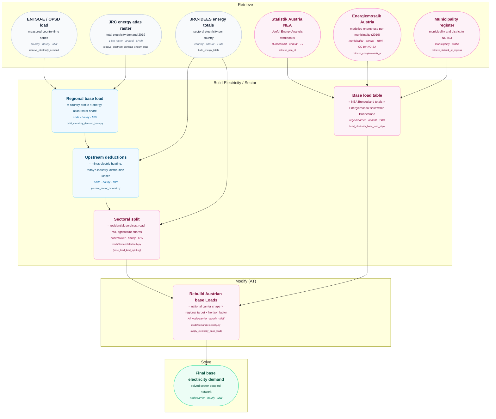

# Electricity Base Load

This diagram traces the Austrian base electricity demand (households, services,
agriculture and rail) from the measured ENTSO-E country profile and the Austrian
statistics to the sectoral electricity Loads used by the model. A *Load* is the hourly
demand series of one sector in one model region (a "node"). Violet boxes are
Austrian-specific; blue boxes are processing stages shared with PyPSA-Eur. See
[Data Flow Diagrams](index.md) for the diagramming convention.

## Why the base load is regionalised in Austria

PyPSA-Eur distributes the measured Austrian load with the JRC energy atlas, a gridded
map (1 km cells) of estimated annual electricity demand: each region receives the share
of the national hourly profile that its cells hold of the mapped demand. That map
describes *total* electricity demand including industry, while the base
load that remains after the upstream deductions is mainly households, services,
agriculture and rail. Industrial NUTS3 regions such as Linz-Wels or the Obersteiermark
therefore received about twice the base load that Austrian statistics support, and
residential regions around Vienna about half. In regions with a small base load the
population-weighted deduction of electric heating even produced negative hours that
had to be clipped before the solve.

## AT-Specific Processing

- **NEA targets.** The NEA statistics year that represents the first modelled year
  (2024 for 2025; configured under `demand.source_years`) is the source year. Its
  electricity of the NEA sectors is summed per Bundesland:
  private households and services become `electricity for residential` and
  `electricity for services`, agriculture becomes `agriculture electricity` and railways
  become `electricity for rail`. For households and services the useful energy category
  *Raumklima und Warmwasser* is excluded, because heat pumps and resistive heaters supply
  that demand inside the model. Cooling electricity is part of the same NEA category and
  is therefore a known gap of the base load. Industry belongs to the
  [industrial demand](industrial-demand.md) override, other land transport to the
  [road mobility](road-demand.md) override, and pipeline transport is the endogenous
  electricity use of gas pipeline compression.
- **Regional split.** Inside each Bundesland the targets are distributed to the model
  regions with the Energiemosaik Austria purpose *Motoren / Elektrogeräte* of the matching
  sector (housing, services, agriculture and forestry). Energiemosaik is a modelled
  municipality dataset with data year 2019 and no explicit electricity carrier, so this
  purpose is used as the closest proxy for non-heating electricity. Municipalities are
  assigned to model regions through the Statistik Austria municipality register, with the
  district as fallback for municipalities merged since 2019. Rail has no Energiemosaik
  proxy and is split by population. Alternatively every carrier can be split by
  population, which avoids the Energiemosaik download and its non-commercial licence
  (CC BY-NC-SA 3.0 AT) at the cost of a coarser regional picture
  (`mods.electricity_base_load.distribution_key: population`).
- **Rebuild of the Loads.** During the modify phase every Austrian base-load carrier
  keeps the Austrian aggregate profile of its Loads, i.e. the measured ENTSO-E shape
  after the upstream deductions. The regional time series are rebuilt as that shape
  times the regional annual target times a horizon factor. The factors describe the
  growth of the base load relative to the NEA source year; the current values (1.0 in
  2025, 1.05 in 2030, 1.10 in 2040 and 2050) are calibrated so that the total Austrian
  electricity demand meets the ÖNIP 2040 band and will be replaced by the UBA Transition
  scenario values (`mods.electricity_base_load.scaling_factors`). Regional demand series
  outside Austria are not touched.
- **Road share.** The JRC-IDEES road electricity that PyPSA-AT carries as
  `electricity for road` on the low voltage bus is removed for Austria when the NEA road
  transport override is active, because the NEA electricity of *Sonstiger Landverkehr*
  already feeds the EV Loads. Urban rail and trams are part of the JRC rail totals, not
  of the road share.
- **Effect on the totals.** The rebuild calibrates the Austrian base load to the NEA
  sector values. Compared with the previous measured-load basis this lowers the Austrian
  base load, because grid losses, pumped storage consumption and the statistical gap
  between the measured load and the bottom-up statistics no longer sit in the base load.
- **Tests.** The integration tests check that every Austrian base-load Load carries its
  table value times the horizon factor, that the Austrian electricity withdrawal in 2030
  and 2040 is within ±10 % of the ÖNIP projections (90 and 121 TWh), and warn when the
  endogenous gas compression electricity deviates from the NEA pipeline transport value.
