# Load Data Pipeline and Generic Data Updates

!!! warning "Status: concept draft — not implemented"

    This page describes (a) how exogenous `Load` data is produced today and (b) a proposed
    `LoadUpdate` abstraction to make data updates repeatable. Part (a) documents existing
    behaviour and is verifiable against the code. Part (b) is a design proposal for review.
    Nothing in `mods/` implements the proposed class yet.

## 1. Why

Every exogenous demand in PyPSA-AT reaches the optimisation as a `Load` component, and every
one of them is produced by the same conceptual recipe: *take a number that is measured at some
spatial level, some temporal level, in some unit, for some year — and turn it into `p_set` at
model-region resolution on the model snapshot calendar.*

The recipe is implemented eight times, in eight different ways, and no two implementations
agree on how they derive a region, which snapshot weighting they use, or where the carrier
naming mapping lives. Adding an Austrian data source (NEA, AGGM expert data, Statistik Austria
Verkehrsstatistik) today means writing a new bespoke build script plus a new bespoke
`mods/demand/*.py` applier, and re-deriving the same three or four transformations by hand.

The goal of this concept is to name the transformations once, make them composable, and let a
new data source be a **declaration** rather than a new code path.

## 2. What a Load actually is

A PyPSA `Load` carries exactly two pieces of data:

| Representation | Field | Meaning |
|----------------|-------|---------|
| static  | `n.loads.p_set` (MW) | constant power over all snapshots |
| dynamic | `n.loads_t.p_set` (MW) | power per snapshot |

Both are bound to annual energy by the snapshot weightings:

```
E [MWh/a]  =  Σ_t  p_set(t) · w_t          with  w = n.snapshot_weightings.generators
p_set      =  E / Σ_t w_t                  (static case)
```

A Load is therefore fully determined by four coordinates plus a naming decision:

1. **Quantity and unit** — TJ useful energy, TWh final energy, MWh, `100 km` driven, kt product
2. **Spatial level** — EU · country · NUTS2 · NUTS3 · model region · site
3. **Temporal level** — annual · monthly · daily · hourly · model snapshots · *none* (static)
4. **Vintage** — the source year the number was measured in, vs. the planning horizon it is used for
5. **Carrier taxonomy** — the source's own sector/energy-carrier names vs. the model's Load `carrier`

The user's framing (spatial always required, temporal optional) is exactly right, and shows up
in the code as the static/dynamic split. But **the unit and the vintage axes are just as load-bearing
and are currently the least visible ones** — they are handled by scattered magic numbers
(`* 1e6`, `/ nhours`, `TJ_PER_TWH`) and ad-hoc dicts (`source_years: {2025: 2024}`).

## 3. The five canonical stages

Every existing Load pipeline in this repository is a subsequence of these five stages:

| # | Stage | What it needs | Loss-free? |
|---|-------|---------------|------------|
| S0 | **Ingest** — read the raw source into long form | parser | — |
| S1 | **Harmonise** — unit conversion, quantity conversion, carrier/sector renaming, vintage selection | unit factor, efficiency, mapping, year map | quantity conversion is *not* |
| S2 | **Spatial** — aggregate (sum) or disaggregate (× key) onto model regions | distribution key summing to 1 per parent | yes, by construction |
| S3 | **Temporal** — keep annual (static) or apply a normalised profile onto snapshots | profile summing to 1 per (region, carrier, year) | yes, by construction |
| S4 | **Apply** — write to `p_set`, as `add` / `replace` / `scale` | Load selection, static-vs-dynamic decision | yes |

S2 and S3 are the two that use *heuristics* — population and GDP shares, industrial site
emissions, weather-derived heating-degree days, traffic counts, FfE sector shapes. S1 is the
one that silently changes physical meaning (useful → final energy, energy → distance).

```mermaid
%%{init: {'theme': 'base', 'themeVariables': {'fontFamily': 'Inter, -apple-system, Segoe UI, sans-serif', 'fontSize': '15px', 'lineColor': '#cbd5e1', 'primaryTextColor': '#1e293b', 'edgeLabelBackground': '#ffffff'}, 'flowchart': {'curve': 'basis', 'nodeSpacing': 45, 'rankSpacing': 55, 'padding': 20}}}%%
flowchart TD
    classDef source fill:#f8fafc,stroke:#cbd5e1,stroke-width:1px,color:#1e293b,rx:10,ry:10
    classDef step fill:#f0f9ff,stroke:#7dd3fc,stroke-width:1px,color:#0c4a6e,rx:10,ry:10
    classDef aggstep fill:#fffbeb,stroke:#fcd34d,stroke-width:1px,color:#78350f,rx:10,ry:10
    classDef final fill:#ecfdf5,stroke:#6ee7b7,stroke-width:1.5px,color:#064e3b,rx:10,ry:10
    classDef at fill:#fdf2f8,stroke:#f9a8d4,stroke-width:1.5px,color:#831843,rx:10,ry:10

    SRC(["<div style='padding:12px 26px'><b>S0 · Raw source</b><br/><span style='font-size:12px'>JRC-IDEES · Eurostat · ENTSO-E · NEA · PEMMDB</span><br/><i style='font-size:11px;color:#64748b'>country or NUTS2 · annual · ktoe/TJ/MWh</i></div>"]):::source

    HARM["<div style='padding:10px 18px'><b>S1 · Harmonise</b><br/><span style='font-size:12px'>= unit × quantity × carrier map × vintage</span><br/><i style='font-size:11px;color:#0e6ba8'>same level · TWh/a per model carrier</i><br/><span style='font-size:9.5px;color:#5b9bd5;font-family:monospace'>build_energy_totals.py · build_nea_at.py</span></div>"]:::step

    SPAT["<div style='padding:10px 18px'><b>S2 · Spatial (dis)aggregation</b><br/><span style='font-size:12px'>📍 key: population · GDP · site emissions · port outflow</span><br/><i style='font-size:11px;color:#92702a'>model region · annual · TWh/a</i><br/><span style='font-size:9.5px;color:#a88a4e;font-family:monospace'>build_*_distribution_key.py · pop_layout.fraction</span></div>"]:::aggstep

    TEMP["<div style='padding:10px 18px'><b>S3 · Temporal disaggregation</b><br/><span style='font-size:12px'>🕑 profile: HDD+BDEW · traffic counts · FfE shapes · ENTSO-E</span><br/><i style='font-size:11px;color:#92702a'>model region · snapshots · normalised</i><br/><span style='font-size:9.5px;color:#a88a4e;font-family:monospace'>build_hourly_heat_demand.py · build_transport_demand.py</span></div>"]:::aggstep

    APPLY["<div style='padding:10px 18px'><b>S4 · Apply to network</b><br/><span style='font-size:12px'>= E/Σw (static) or E·profile (dynamic)</span><br/><i style='font-size:11px;color:#0e6ba8'>Load · MW</i><br/><span style='font-size:9.5px;color:#5b9bd5;font-family:monospace'>prepare_sector_network.py</span></div>"]:::step

    ATOVR["<div style='padding:10px 18px'><b>AT override (post-hoc)</b><br/><span style='font-size:12px'>= re-run S1–S3 on Austrian data, rewrite p_set</span><br/><i style='font-size:11px;color:#9d174d'>AT model region · annual or snapshots</i><br/><span style='font-size:9.5px;color:#be185d;font-family:monospace'>mods/demand/annual.py · industrial_demand.py · electricity.py</span></div>"]:::at

    CLIP["<div style='padding:10px 18px'><b>Repair</b><br/><span style='font-size:12px'>= clip negatives from heuristic over-deduction</span><br/><i style='font-size:11px;color:#9d174d'>hard-coded region/resolution edge cases</i><br/><span style='font-size:9.5px;color:#be185d;font-family:monospace'>mods/network/common.py</span></div>"]:::at

    OUT(["<div style='padding:12px 26px'><b>Load p_set</b><br/><i style='font-size:11px;color:#047857'>model region · static or snapshots · MW</i></div>"]):::final

    SRC --> HARM --> SPAT --> TEMP --> APPLY --> ATOVR --> CLIP --> OUT
```



The Austrian overrides sit **after** S4: the network is built with JRC/Eurostat numbers, and
then `mods/demand/*` rewrites `p_set` in place. That is the single most important structural
observation in this document — see [§6](#6-the-central-design-question).

## 4. Inventory of exogenous Loads

All Load carriers present in a PyPSA-AT network, with the coordinates that produced them.
"static" means `n.loads.p_set`; "dynamic" means `n.loads_t.p_set`.

### 4.1 Electricity

| Load carrier | Spatial | Temporal | Source and heuristic | Written by |
|---|---|---|---|---|
| `electricity` (base load) | model region | dynamic | measured ENTSO-E/OPSD country load, split to regions by **population + GDP** (energy-atlas raster, GB LAD statistics) | `build_electricity_demand_base.py` → `add_electricity.py` |
| `electricity for residential` | model region | dynamic | **AT**: base-load share ∝ JRC-IDEES residential electricity minus space/water heat | `mods/demand/electricity.py` |
| `electricity for services` | model region | dynamic | **AT**: as above, services | `mods/demand/electricity.py` |
| `electricity for road` | model region | dynamic | **AT**: share ∝ `electricity road` | `mods/demand/electricity.py` |
| `electricity for rail` | model region | dynamic | **AT**: share ∝ `electricity rail` | `mods/demand/electricity.py` |
| `industry electricity` | model region | static → **dynamic (AT)** | production × sector ratios; AT applies normalised **FfE** subsector shapes | `add_industry()`, `mods/demand/industrial_demand.py` |
| `agriculture electricity` | model region | static → **dynamic (AT)** | pop-weighted energy totals; AT replaces with base-load share | `add_agriculture()`, `mods/demand/electricity.py` |
| `agriculture machinery electric` | model region | static | pop-weighted totals × electric share / efficiency gain | `add_agriculture()` |

### 4.2 Heat

| Load carrier | Spatial | Temporal | Source and heuristic | Written by |
|---|---|---|---|---|
| `{heat_system} heat` (×5 systems) | model region | dynamic | atlite **heating-degree-days** from ERA5 cutout, population-distributed, × **BDEW** intraday profile, × district-heating share and losses | `build_daily_heat_demand.py` → `build_hourly_heat_demand.py` → `add_heat()` |
| `low-temperature heat for industry` | model region | static | industry sector ratios | `add_industry()` |
| `agriculture heat` | model region | static | pop-weighted totals | `add_agriculture()` |

### 4.3 Transport

| Load carrier | Spatial | Temporal | Source and heuristic | Written by |
|---|---|---|---|---|
| `land transport EV` | model region | dynamic | **road+rail final energy** ÷ *average fuel efficiency* [MWh/100 km] → km driven, × weekly **traffic count** profile, × temperature degree factor, × electric share ÷ EV efficiency | `build_transport_demand.py` → `add_land_transport()` |
| `land transport fuel cell` | model region | dynamic | same chain, fuel-cell share | `add_land_transport()` |
| `land transport oil` | region or EU¹ | dynamic | same chain, ICE share | `add_land_transport()` |
| `kerosene for aviation` | region or EU¹ | static | energy totals × `aviation_demand_factor` per horizon | `add_aviation()` |
| `H2 for shipping` / `shipping methanol` / `shipping oil` | region or EU¹ | static | international navigation totals distributed by **port outflow volume** | `build_shipping_demand.py` → `add_shipping()` |

¹ Regional if the corresponding `sector: regional_*_demand` flag is set; otherwise a single EU-level
bus and Load. PyPSA-AT sets `regional_methanol_demand` and `regional_coal_demand`; `gas_network: true`
regionalises gas.

### 4.4 Industry and other

| Load carrier | Spatial | Temporal | Source and heuristic | Written by |
|---|---|---|---|---|
| `gas for industry`, `H2 for industry`, `solid biomass for industry`, `naphtha for industry`, `coal for industry`, `industry methanol`, `NH3` | region or EU¹ | static | production per country × **Hotmaps site emissions** key (population fallback) × sector/carrier ratios | `build_industrial_*` → `add_industry()` |
| `process emissions` | region or EU¹ | static, **negative** | process emission factors | `add_industry()` |

### 4.5 Austrian overrides currently in place

| Mechanism | Stages used | Config gate |
|---|---|---|
| NEA annual industry totals → replace `p_set` | S0–S4, `Produzierender Bereich` only, TJ→TWh, NUTS2→region by industrial keys | `industry.annual_demand_overrides` |
| FfE normalised industry electricity profiles | S3 only (energy-preserving) | `industry.demand_profiles` |
| Base-load sectoral split | S2/S3 reuse of the existing ENTSO-E shape | always on |
| Negative-load clipping | repair | hard-coded |

## 5. What is inconsistent today

These are the concrete defects a shared abstraction would remove. Each is verifiable in the
current code.

**Region derivation differs per module.**
`mods/demand/annual.py` maps `n.loads.bus → n.buses.location` with a fallback to the bus name;
`mods/demand/industrial_demand.py` uses `name.split(" ")[0]`. The two disagree for any Load
whose bus is not the region bus (e.g. `AT11 gas for industry`, EU-level buses).

**Snapshot weighting column differs per module.**
`mods/demand/annual.py` and `prepare_sector_network.py` use `snapshot_weightings.generators`;
`scripts/pypsa-de/modify_prenetwork.py::modify_mobility_demand` uses `.stores` and additionally
normalises by a literal `8760`. These coincide today but are not guaranteed to.

**Static and dynamic Loads for the same (region, carrier) double-count.**
In `apply_annual_demand_overrides`, the full target `value` is written to the dynamic Loads
(via rescaling) *and* to `names.difference(dynamic_names)` as flat power. If a group ever
contains both kinds, the target energy is applied twice.

**Silent zeroing.** `factor = np.where(annual_dynamic_energy > 0, value / annual_dynamic_energy, 0)`
turns a missing profile into a zero demand rather than an error, contradicting the project rule
*"let the workflow fail early on missing input"*.

**Ordering is implicit and load-bearing.** `apply_annual_demand_overrides` must run before
`apply_industrial_demand_profiles`, otherwise the NEA total overwrites the profile instead of
being shaped by it. Nothing in the code states or enforces this.

**Carrier naming lives in three places.** `CARRIER_MAPPING` (`build_nea_industry_demand.py`,
NEA Energieträger → model carrier), `demand.carrier_to_load_mapping` (config, sector/carrier →
Load carrier), and `industry.demand_profiles.carrier_mapping` (config, profile carrier → Load
carrier).

**Unit conversions are inline magic numbers.** `TJ_PER_TWH` in `mods/constants.py`; `* 1e6`
(TWh→MWh) in at least four call sites; `/ 1e6` then `* 1e6` for kgoe/100 km → MWh/100 km in
`build_energy_totals.py`; `/ 1e3` for kt→Mt. `evals/constants.py::UNITS` has a units table, but
it is a display-scaling table for the evaluation side only and carries no quantity dimension.

**Heuristic over-deduction is repaired by hard-coded exception lists.**
`clip_negative_loads_for_edge_cases` enumerates `("AL", "AT111", "AT112", "AT126", "IT1", "IT2")`
per temporal resolution and raises if the expected negatives are *absent*. This is the pipeline
telling us that the electric-heating deduction from the measured base load has no conservation
guard.

**Stated-but-unimplemented validation.** `test/test_mods/demand/test_electricity.py`
reads `mods.demand.electricity` and only `print`s the expected value; the config key does not
exist in `config.at.yaml` (only `solving.constraints.demand.electricity`, which has no consumer
anywhere in the repository). The intent — *assert modelled annual demand per country against a
configured target* — is exactly the invariant the proposed class should own.

## 6. The central design question

There are two structurally different places to apply an Austrian data update:

=== "A · Post-hoc network patch (today)"

    Build the network with upstream data, then rewrite `p_set` in `prepare_sector_network`
    or `modify_prenetwork`.

    - ✅ No upstream files touched; works for every Load regardless of how it was built
    - ✅ Cheap — no DAG changes
    - ❌ Every applier must *reverse-engineer* the annual total from `p_set` and weightings
    - ❌ Coupled Links (BEV chargers, V2G, boiler capacities) are sized from the *old* demand and
      silently go out of sync — `modify_mobility_demand` in the DE lineage has to rescale them by hand
    - ❌ Ordering between appliers is implicit

=== "B · Resource-level override"

    Replace the resource file (`industrial_energy_demand_per_node`, `pop_weighted_energy_totals`,
    `transport_demand`) before `prepare_sector_network` reads it.

    - ✅ Everything downstream — Loads *and* coupled Links — is consistent by construction
    - ✅ The annual total never has to be recovered from `p_set`
    - ❌ Requires either upstream rule patching (`use rule ... with:`) or an AT-owned rule
      producing a same-shaped file
    - ❌ Only works for demands that *have* a resource file; the ENTSO-E base load does not

The proposal below is deliberately agnostic: `LoadUpdate` produces a **region × carrier × time
table with declared coordinates**, and offers both a `to_resource()` and a `to_network()` sink.
Mode B is preferred wherever a resource file exists. **This is the main point I would like
decided in review.**

## 7. Proposed abstraction

### 7.1 Core value object

The single thing that flows through the pipeline is a table plus its coordinates.

```python
@dataclass(frozen=True)
class Coordinates:
    """Declares what a demand table physically means."""
    quantity: Quantity        # USEFUL_ENERGY | FINAL_ENERGY | DISTANCE | PRODUCTION | POWER
    unit: str                 # "TJ" | "TWh" | "MWh" | "MW" | "100km" | "kt"
    spatial: SpatialLevel     # EU | COUNTRY | NUTS2 | NUTS3 | MODEL_REGION | SITE
    temporal: TemporalLevel   # NONE | ANNUAL | MONTHLY | DAILY | HOURLY | SNAPSHOTS
    vintage: int | None       # the year the data was measured
    taxonomy: str             # "nea" | "jrc" | "model" — which carrier vocabulary


class DemandTable:
    """Long-form ``region, carrier, [snapshot], value`` plus its Coordinates."""
    frame: pd.DataFrame
    coords: Coordinates
```

Every transformation returns a new `DemandTable` with updated `Coordinates`. A transformation
that cannot be justified by the coordinates (e.g. disaggregating without a key, or writing a
`DISTANCE` table to a Load) raises instead of guessing.

### 7.2 Transformations

```python
class LoadUpdate:
    def __init__(self, table: DemandTable, registry: Registry): ...

    # --- S1 harmonise -------------------------------------------------
    def to_unit(self, unit: str) -> Self
    def to_quantity(self, quantity: Quantity, *, via: Converter) -> Self
    def to_taxonomy(self, taxonomy: str) -> Self          # NEA → model carriers
    def select_vintage(self, target_year: int) -> Self    # replaces `source_years`

    # --- S2 spatial ---------------------------------------------------
    def to_spatial(self, level: SpatialLevel, *, key: str | None = None) -> Self

    # --- S3 temporal --------------------------------------------------
    def to_temporal(self, level: TemporalLevel, *, profile: str | None = None) -> Self

    # --- S4 sinks -----------------------------------------------------
    def to_network(self, n, *, mode: Literal["add", "replace", "scale"]) -> None
    def to_resource(self, path) -> None
```

`to_spatial` picks aggregation (groupby-sum, always allowed) or disaggregation (requires a
`key`) from the direction of travel — the caller does not choose.

### 7.3 Registries

Three lookup registries make new data sources declarative rather than procedural.

**Distribution keys (S2)** — a key is `Series[region] → share`, normalised to 1 per parent:

| Key | Source | Already exists as |
|---|---|---|
| `population` | pop layout | `clustered_pop_layout.fraction` |
| `population_gdp` | energy atlas raster / GB LADs | `build_electricity_demand_base.py` |
| `industry:<subsector>` | Hotmaps site emissions | `industrial_distribution_key_*.csv` |
| `port_outflow` | world port index | `build_shipping_demand.py` |
| `heat_demand` | HDD × population | derived from daily heat demand |
| *(new)* `vehicle_registrations` | Statistik Austria | — |

**Profiles (S3)** — normalised to sum 1 per (region, carrier, year):

| Profile | Source | Already exists as |
|---|---|---|
| `entsoe_base_load` | measured load shape | `n.loads_t.p_set` of `electricity` |
| `bdew_heat` | HDD × BDEW intraday | `build_hourly_heat_demand.py` |
| `traffic_weekly` | weekly counts + temperature factor | `build_transport_demand.py` |
| `ffe_industry:<subsector>` | FfE Open Data | `build_industrial_demand_profiles.py` |
| `flat` | — | implicit static case |

**Converters (S1)** — declared quantity changes, each with an explicit factor source:

| Converter | From → To | Factor |
|---|---|---|
| `fuel_efficiency` | `FINAL_ENERGY` → `DISTANCE` | `transport_data["average fuel efficiency"]` [MWh/100 km] |
| `drivetrain` | `DISTANCE` → `FINAL_ENERGY` | EV / FC / ICE efficiency incl. temperature degree factor |
| `useful_to_final` | `USEFUL_ENERGY` → `FINAL_ENERGY` | per carrier/sector efficiency (NEA ↔ Energiebilanz) |
| `sector_ratios` | `PRODUCTION` → `FINAL_ENERGY` | `industry_sector_ratios` [TWh/t] |

This is where the NEA transport case the concept was raised for lands: NEA gives
*Nutzenergie* per Bundesland; PyPSA's `land transport *` Loads are built from `100 km` driven.
The chain becomes explicit and reviewable:

```python
(LoadUpdate.from_nea(nea, category="Transport")      # TJ, USEFUL_ENERGY, NUTS2, annual, 2024
   .to_unit("TWh")
   .to_quantity(FINAL_ENERGY, via="useful_to_final")
   .to_taxonomy("model")
   .select_vintage(2030)
   .to_spatial(MODEL_REGION, key="vehicle_registrations")
   .to_quantity(DISTANCE, via="fuel_efficiency")     # → 100 km, matches PyPSA's internal unit
   .to_temporal(SNAPSHOTS, profile="traffic_weekly")
   .to_resource(snakemake.output.transport_demand))  # mode B: coupled Links stay consistent
```

### 7.4 Config surface

One named update per data source, all five stages visible in the config:

```yaml
demand:
  updates:
    at_industry_nea:
      enable: true
      source: nea_at
      filter: {category: "Produzierender Bereich"}
      vintage: {2025: 2024, 2030: 2024}
      taxonomy: nea
      spatial: {level: model_region, key: "industry:<subsector>", fallback: population}
      temporal: {level: snapshots, profile: "ffe_industry"}
      sink: {kind: network, mode: replace, scope: {country: AT}}
      order: 10
```

`order` makes the currently-implicit applier sequence explicit. The DAG must stay
config-independent (project rule), so the rule always produces the resource and the Python
script decides — as `apply_annual_demand_overrides` already does with its early `return`.

### 7.5 Invariants the class enforces

Each of these replaces a defect from [§5](#5-what-is-inconsistent-today):

1. **Energy conservation across S2/S3.** `Σ output == Σ input` within tolerance, unless the step
   is a declared `to_quantity` conversion. Raise, do not warn.
2. **Keys and profiles are normalised.** Sum to 1 per parent / per (region, carrier, year), checked on load.
3. **Spatial completeness.** Every region in the busmap is covered; missing regions raise.
4. **No mixed static/dynamic within a target group.** Detected in `to_network`, raise.
5. **Sign discipline.** Negative `p_set` raises unless the carrier is declared signed
   (`process emissions`); this replaces `clip_negative_loads_for_edge_cases` with a conservation
   guard at the point the deduction happens.
6. **Single weighting source.** `snapshot_weightings.generators`, defined once.
7. **Single region derivation.** `n.buses.location`, defined once.
8. **Annual target assertion.** Post-write check of modelled TWh/a per (country, carrier)
   against a configured target — the invariant `test_electricity.py` was reaching for.

## 8. Extension beyond Loads

The same five stages describe the other exogenous datasets, which is the argument for putting
the machinery in a shared base rather than in `mods/demand/`:

| Dataset | S1 | S2 | S3 | S4 target |
|---|---|---|---|---|
| **Hydro inflow** (PEMMDB + ERA5) | GWh/day, GWh/week → MWh | TYNDP zone → model region (`resolve_tyndp_locations`) | ERA5 normalised runoff profile | `StorageUnit.inflow` / Generator `p_max_pu` |
| **Brownfield capacities** (TYNDP, Anlagenregister, AGGM) | MW, MWh | zone/postal-code → model region | none (static) | `p_nom` / `e_nom`, trajectory bounds |
| **Renewable potentials** (KLIEN) | GW | NUTS → model region | none | `p_nom_max` |
| **Costs** (custom cost files) | EUR/MW | none | vintage per horizon | `costs` frame |

The differences are the sink and the profile semantics (inflow profiles are *not* normalised to
an annual 1 in the same way). A plausible split is a generic `DataUpdate` owning S0–S3 plus the
coordinate algebra, with thin `LoadUpdate` / `CapacityUpdate` / `InflowUpdate` subclasses owning
S4 and the sink-specific invariants.

## 9. Suggested implementation phases

Each phase is independently shippable and behaviour-preserving until phase 4.

| Phase | Scope | Risk |
|---|---|---|
| 1 | `Coordinates`, `DemandTable`, unit/quantity registry, invariant checks. Pure library plus unit tests, no callers. | none |
| 2 | Characterisation tests pinning today's `p_set` for the AT network, then re-express `apply_annual_demand_overrides` and `apply_industrial_demand_profiles` on top of `LoadUpdate` with byte-identical output. Fixes the region-derivation and double-count defects. | low |
| 3 | Key and profile registries; move `base_load_load_splitting` onto them. | low |
| 4 | NEA transport (`Transport` category) as the first *new* source, mode B via a resource-level override, exercising `to_quantity`. | medium — first real behaviour change |
| 5 | Retire `clip_negative_loads_for_edge_cases` in favour of the conservation guard. | medium |
| 6 | Generalise the base class; migrate inflow and one brownfield dataset. | medium |

## 10. Open questions for review

1. **Mode A or mode B** ([§6](#6-the-central-design-question))? Mode B is the only one that keeps coupled
   Links (BEV chargers, V2G, boilers) consistent, but it needs upstream rule patching.
2. **Authority when sources disagree.** When NEA and JRC-IDEES give different totals for the same
   region/carrier: full replace (today), or a calibration factor applied to the JRC shape? The
   latter preserves the JRC subsector structure that `industry_sector_ratios` depends on.
3. **Useful → final energy efficiencies.** NEA is *Nutzenergie*. Where do the per-carrier,
   per-sector efficiencies come from — Energiebilanz ratios, JRC, or expert values? This is the
   largest missing input for the transport case.
4. **Is `Quantity` worth the machinery**, or should every source be normalised to MWh final
   energy at S1 and the `100 km` intermediate be treated as PyPSA-internal only?
5. **Where does the class live** — `mods/demand/` (Load-only, ships sooner) or a new
   `mods/data/` (generic, matches §8)?
6. **Vintage semantics.** `source_years: {2025: 2024}` currently means "use 2024 data for 2025".
   For 2030/2040/2050 a projection is needed — is that in scope for this class, or upstream of it?
7. **Dead config.** `solving.constraints.demand.electricity.AT` has no consumer. Remove it, or
   is it the intended home for invariant 8?
