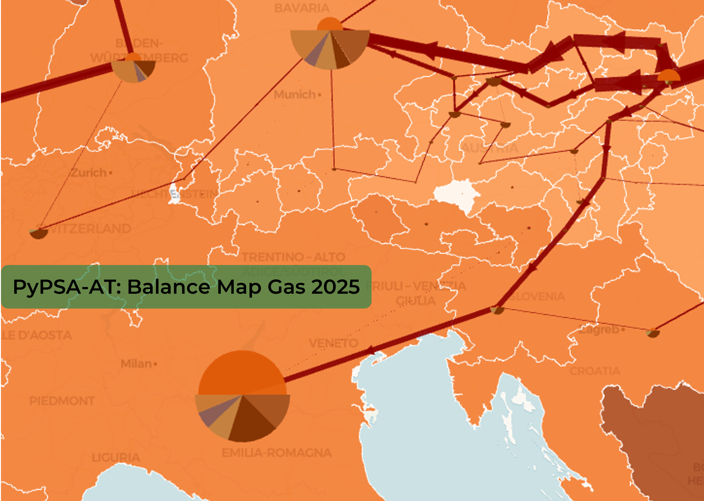

# Modified brownfield of the Austrian gas grid
## PyPSA-Eur default
The default dataset used in PyPSA-Eur is the [SciGRID_gas](https://zenodo.org/records/4767098) dataset. While this is a reasonably accurate dataset for the low spatial resolution of PyPSA-Eur, a more refined resolution on a sub-national level is not given. 
The values for capacities given for transport corridors between Austrian regions when using a NUTS3 clustering especially are not realistic and need to be improved for a truly sector-coupled consideration of the Austrian energy system. 


{ height="500" }

{ height="500" }


## In PyPSA-AT 
PyPSA-AT is hosted and maintained by the [Austrian Gas Grid Management GmbH](https://www.aggm.at/en/). This means that PyPSA-AT can be supplied directly with expert knowledge of the complete Austrian brownfield gas grid. 
In collaboration with those experts, a dataset for Austria was generated and added to PyPSA-AT in the `/data/pypsa-at/` folder. 

The dataset is maintained at NUTS3 resolution (35 Austrian regions, file `AGGM_gas_network_base_AT35.csv`). It holds the capacities of the links between regions ("transport corridors"), the reverse capacity of asymmetric corridors, and the year each corridor was commissioned. Data on pipeline diameter is not added and will not be added due to reasons of confidentiality. Corridor lengths are not supplied either; they are computed from the distance between the region centroids by `calculate_corridor_lengths`, the same way `cluster_gas_network` derives them for the rest of Europe. 

For a NUTS2 run (ten Austrian regions), `aggregate_gas_pipeline_corridors_to_nuts2` derives the coarser network from the same file: each corridor's buses are remapped to their NUTS2 parent region, corridors that then start and end in the same region are dropped, and all corridors between the same pair of regions are merged into one by summing each flow direction on its own. It does not matter which region a NUTS3 row names first: the merged corridor always points along its stronger flow direction. 

Only those two AT clusterings are supported; any other raises an error in the rule. 

## Rule `modify_brownfield_gas_network_AT` 
To overwrite the original dataset for Austrian regions, a new rule was introduced. It is built between the existing rules `cluster_gas_network` and `prepare_sector_network`. The new rule takes the output of the clustering rule, modifies it, and returns its output to `prepare_sector_network`. If the config setting for modification of the Austrian brownfield is disabled, the rule is still called, but only passes the input through, preserving the original workflow. 

## In `config.at.yaml` 
The changes added by this improved dataset can be turned on via the config setting 
`modify_brownfield_gas_network_AT`:  
```yaml 
mods: 
    modify_brownfield_gas_network_AT: true
```

---
# Asymmetric and monodirectional gas pipelines

Real pipelines are directional, because compressor stations are built and sized for one direction.
AGGM models the TAG (Trans-Austria-Gas pipeline) as three parallel corridors between AT211 and
IT0, each rated 16 672 MW north-south against 6 015 MW south-north, so 50 GW against 18 GW in
total.

PyPSA-Eur labels a corridor either bidirectional or monodirectional and nothing in between, then
loses even that: `lossy_bidirectional_links` in `scripts/prepare_sector_network.py` splits every
carrier listed under `sector.transmission_efficiency.enable` into a forward and a reverse Link,
zeroes `p_min_pu`, and copies `p_nom` onto the reverse leg. The split is wanted, because the
reverse leg is free (`capital_cost = 0`, `length = 0`) and the corridor is billed once. The copied
capacity is not: a compressor-limited corridor comes out symmetric, and a monodirectional one
gains a reverse direction it does not have.

The AGGM dataset adds a `p_nom_reverse` column, set only on bidirectional rows and never larger
than `p_nom`. `apply_reverse_flow_limits` converts it into the PyPSA bound and drops the column:

| `p_min_pu` | Corridor | Reverse capacity |
|---|---|---|
| `-1` | symmetric, bidirectional | equal to `p_nom` |
| between `-1` and `0` | asymmetric | `-p_min_pu x p_nom` |
| `0` | monodirectional | none |

`restore_asymmetric_pipeline_capacities` in `mods/network/gas.py` then runs during
`modify_prenetwork`, for Austrian corridors only:

1. Select the corridors whose `p_min_pu` lies in `(-1, 0]`. Symmetric ones sit at `-1` and are
   skipped.
2. Resize the reverse leg to `-p_min_pu x p_nom`, which is zero for a monodirectional corridor.
3. Fix those legs with `p_nom_extendable = False`, so
   `add_lossy_bidirectional_link_constraints` does not tie them back to the forward leg.

This holds up to `threshold_year_for_gas_grid_expansion` (see below). From the next planning
horizon on the model may invest in the grid, so both legs stay extendable and a corridor is free
to be turned, decommissioned or rebuilt in either direction.

---
# Extendable pipeline capacity and new pipelines 
In addition to the data update, two more tightly linked changes to the gas network were added. 

## Non-extendable pipeline capacities up to a threshold year
`make_gas_pipelines_unextendable` in `mods/network/gas.py` runs during `modify_prenetwork` and sets both the existing pipelines (`gas pipeline`) and the candidates for new ones (`gas pipeline new`) to be non-extendable, up to and including a threshold year. This threshold year is set with the config setting `threshold_year_for_gas_grid_expansion`, which `config/config.at.yaml` ships as 2040. 
In config.at.yaml: 
```yaml 
mods: 
  threshold_year_for_gas_grid_expansion: 2035
```

## No new methane pipelines before the threshold year
To conform with reality, where no large scale expansion of the methane grid is planned in the near term, candidates with carrier type `gas pipeline new` cannot be built up to the threshold year. From the following planning horizon on they become extendable again, so the model may add methane pipelines where the long-term optimum calls for them.

