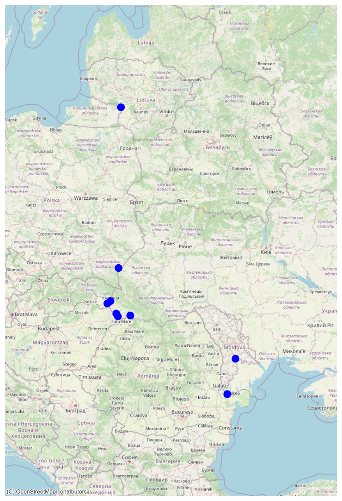

# Ukrainian Gas Transit

## Default in PyPSA-Eur 
The **default** in PyPSA-Eur is currently that imports of gas through Ukraine into the eastern part of the European Union (through Poland, Slovakia, Hungary and Romania) are possible with significant capacities. 


## In PyPSA-AT 
### Background
To better reflect the reality of the situation - that no methane is flowing across Ukrainian border points into the European Union - those locations are "turned off" in PyPSA-AT. 
In cooperation with experts on the European gas grid at AGGM (Austrian Gas Grid Management) AG, the cross border points in eastern Europe were identified. 
They can be found in the provided `data/pypsa-at/ukrainian_gas_transit_stop.json` file and are also identified on the following map and in the following table:




| country | capacity  | geometry                    |
|---------|-----------|-----------------------------|
| HU      | 19883.6254 | POINT (22.59206 48.18885)   |
| HU      | 6928.09249 | POINT (22.68631 48.09047)   |
| LT      | 4395.4897 | POINT (22.85137 54.95471)   |
| PL      | 5219.1630 | POINT (22.73082 49.76771)   |
| RO      | 42881.0436 | POINT (28.46073 45.26542)   |
| RO      | 4541.7495 | POINT (23.33299 48.12078)   |
| SK      | 16011.5915 | POINT (22.12217 48.54841)   |
| SK      | 78056.5087 | POINT (22.28788 48.6208)    |
| NaN     | 50.03622  | POINT (28.89498 46.57521)   |

### Functionality
Those locations were then identified in the `network_updates.py`, where all PyPSA-AT changes on networks are carried out. 
The existing prenetwork is called, and the importing generators, the `network.generators[f"{cc} gas pipeline import]`, are located for each affected country with country code `cc`.
The difference in capacity between the importing generators and the Ukrainian border regions is subtracted from each other, asserting that the locations match. 
To make sure the locations stay disabled, their property `p_nom_extendable` is set to `False`, in order to make them non-optimizable.

The function then returns a modified network `n`. 

### Enable Ukrainian gas transit stop in config 
To enable the described modifications, in `config.at.yaml`, set `ukrainian_gas_transit_stop` to `true`: 
```python
# stop transit of gas into Europe via Ukrainian import
# locations on the borders with PL, SK, HU, RO
ukrainian_gas_transit_stop: true
```
