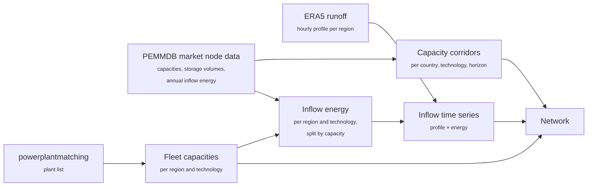
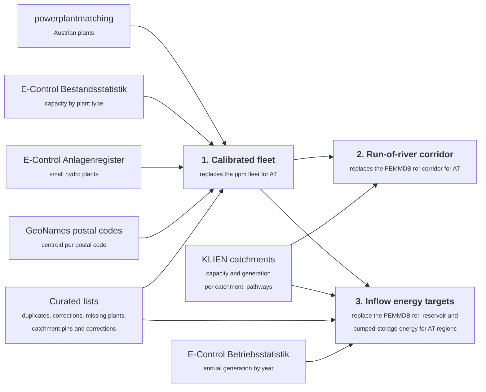

# Hydropower Capacities and Inflows

Hydropower in PyPSA-AT is described by two quantities per model region and technology: the
**capacity** that exists or may be built, and the **inflow**, the water that arrives hour by
hour and can be turbined. This page explains where both come from, why the Europe-wide data
is not good enough for Austria, and how the Austrian values are calibrated against the
E-Control statistics and the KLIEN river-catchment study.

How capacity limits are technically enforced during the solve is described in
[Generic Capacity Trajectories](capacity-trajectories.md). This page covers the hydro
*content* that feeds that mechanism.

## What the model represents

Three hydro technologies exist in the network:

| Technology | Network representation | Role of the inflow |
|------------|------------------------|--------------------|
| Run-of-river | A generator per region (`ror`). | The hourly inflow, divided by the turbine capacity, becomes the maximum availability of the generator. Water that is not turbined in that hour is lost. |
| Reservoir | A store per region (`hydro store`) with a turbine link into the electricity bus (`hydro discharger`) and an inflow generator feeding the store (`hydro inflow`). | The inflow fills the store; the optimizer decides when to turbine it. |
| Pumped storage | A store per region (`PHS store`) with a pump link (`PHS charger`), a turbine link (`PHS discharger`) and an inflow generator (`PHS inflow`). | The natural inflow into the upper reservoir; the bulk of the stored energy comes from pumping. |

An inflow time series is the product of two things that are built separately:

- a **profile**: the shape of the year, i.e. when the water comes. It is derived from
  ERA5 runoff, aggregated per model region, smoothed, and normalised to a sum of one over
  the year of the configured snapshots (2013 by default);
- an **annual energy** per region and technology in MWh, which scales the profile.

The capacity side has two layers as well: the **brownfield fleet**, the plants that exist
today, and a **capacity corridor** per country, technology and planning horizon that bounds
how much the optimizer may add.

!!! info "Terminology"
    **Catchment** (German *Einzugsgebiet*): the KLIEN hydropower study divides every Austrian
    river into stretches, for example "Faggenbach", "Traun bei Krems" or "Donau unterhalb
    Staatsgrenze", and publishes for each stretch the polygon of the land area draining into
    it. There are 289 such catchments; 249 of them carry the installed capacity and the mean
    annual generation of the plants on the stretch. Wherever this page says "catchment", it
    means one such polygon with its two numbers; the five-digit ids (51200, 30407, ...) are
    the study's own. Catchments range from a few to several thousand square kilometres, and
    those of border rivers such as the Danube cannot be attributed to a single Bundesland.

    **Regelarbeitsvermögen (RAV)**: the mean annual generation a plant would deliver with the
    discharge of the 1991–2020 reference period. It is the study's energy figure per
    catchment.

    **Full-load hours**: annual energy divided by capacity. Run-of-river plants on the Danube
    reach 6,000 hours and more, alpine plants often less than 4,000; E-Control reports about
    4,000 hours for the whole Austrian run-of-river fleet in the below-average year 2025 and
    5,470 hours in the wet year 2013.

## Data flow

Every country, Austria included, gets its fleet, corridors and inflows from the Europe-wide
path. Countries that are split into several model regions are not skipped: the corridor is
a national total that the constraint spreads over all regions of the country, and the inflow
energy is split over the regions in proportion to installed capacity.

Austria adds three calibration steps on top, switched by a single option
(`mods.update_hydro_capacities_AT.enable`). Each step replaces one Europe-wide product for
Austria and leaves the rest untouched:

1. The **fleet** is corrected against E-Control data and operator sources
   ([Part 1](#part-1-the-austrian-brownfield-fleet)).
2. The Austrian **run-of-river corridor** becomes a KLIEN growth factor applied to the
   calibrated fleet; reservoir and pumped storage keep their PEMMDB corridors
   ([Part 2](#part-2-capacity-corridors)).
3. The Austrian **run-of-river and reservoir energies** are replaced by per-region targets
   built from the KLIEN catchments, and the pumped-storage natural inflow by E-Control's
   pumped-storage statistic ([Part 3](#part-3-inflows)).

## Part 1: The Austrian brownfield fleet

### Why powerplantmatching is not enough

The brownfield fleet is the fleet of **2025**: powerplantmatching (ppm) as of its current
release, the Anlagenregister with feed-in data up to 2025, and the E-Control
Bestandsstatistik 2025 as the reference. The upstream fleet comes from
[powerplantmatching](https://github.com/PyPSA/powerplantmatching), a merge of several
European plant databases. For Austrian hydropower it has systematic defects:

| Defect | Examples | Effect in the model |
|--------|----------|---------------------|
| **Wrong technology** | The Danube, Drau, Mur, Inn, Salzach and Ill chains are labelled *Reservoir*. | Only 2.4 GW of run-of-river instead of ≈ 6.1 GW, 6.2 GW of reservoirs instead of ≈ 3.4 GW. Because run-of-river inflow is normalised by run-of-river capacity, this alone cut the Austrian river energy from ≈ 34 TWh to ≈ 13 TWh. |
| **Border plants counted twice** | The Inn and Danube *Grenzkraftwerke* shared 50/50 with Bavaria appear at full capacity in Austria, four of them again in Germany. | ≈ 0.3 GW too much in Austria, ≈ 0.2 GW in Germany. |
| **Duplicate entries** | Kaprun and Malta appear as *Hauptstufe* and *Main Stage*; Verbund's Bavarian Inn plant Feldkirchen appears a second time as an Austrian plant in the Mölltal. | ≈ 1 GW of phantom capacity in two alpine valleys. |
| **Wrong capacities** | Rodund I and II merged into one entry, Limberg above its nameplate, Prutz and Reisseck above the operator's figures; Kirchbichl still at its pre-2020 capacity; Gaming at 14 MW instead of 5.6 MW. | Regions with more (or less) capacity than the river can feed. |
| **Wrong location** | Plants geocoded to a same-named village (St. Pantaleon on the Salzach instead of the Enns), to the operator's address (Böckstein, Wald, Weyer, Altenmarkt, Gaming in Vienna). | Capacity in the wrong region; the river energy of the true site has no plant to land on. |
| **Missing plants** | The EVN Kamp chain, the Lech plants in Außerfern, the Salzburg AG city plants, the Sill plants in Innsbruck, the Traun chain, Rodund II, Obervermuntwerk I and Lutz Oberstufe, Partenstein, Plankenau, Wagrain-St. Johann, Schwarzach in the Defereggental, all ÖBB railway plants (Spullersee, Braz, Schneiderau, Uttendorf I, Fulpmes) and the industrial self-suppliers Kitzloch and Wiesberg, which are in no public register. | Regions whose inflow is physically infeasible with the remaining capacity. |
| **Missing small hydro** | Only 22 plants below 10 MW. | The ≈ 1.5 GW small-hydro fleet and its regional distribution are absent. |

### The curated lists

Plant-level corrections cannot be derived from any single dataset, so they live in four
reviewed lists (five with the catchment corrections of Part 3). A **curated entry** is one row of these lists: it names the plant as ppm
spells it, the region and capacity the row expects to find (so a changed upstream dataset is
detected), the correction to apply, and a note with the rationale and the source URL
(operator plant pages, Wikipedia plant articles, the Anlagenregister). The lists are reviewed
data, not configuration.

| List | One entry says |
|------|----------------|
| **Duplicates** | "This entry duplicates that plant (in this country); drop it." The kept twin must exist, otherwise the workflow stops. |
| **Reclassification and relocation** | "This plant has this technology, not that one", optionally with a corrected capacity, region and coordinates. |
| **Missing plants** | "This plant exists with this technology, capacity, commissioning year and coordinates." |
| **Catchment pins** | "This plant's energy belongs to this KLIEN catchment, whatever its coordinates say" (used in Part 3). |
| **Catchment corrections** | "The study's capacity and energy of this catchment are wrong; use these operator figures instead" (used in Part 3). |

### How the fleet is calibrated

The corrections are applied in a fixed order, each step on the result of the previous one:

| Step | What it does | Source |
|------|--------------|--------|
| **Drop duplicates** | Removes the second entry of a plant listed twice, after checking that the kept twin is present. | Duplicates list |
| **Reclassify, relocate, correct** | Moves each listed plant to the right technology (31 river-chain plants become run-of-river, Enzingerboden fed from the Tauernmoos reservoir becomes a reservoir plant), corrects nameplate capacities, and moves plants with wrong coordinates to their actual site. | Reclassification list |
| **Apply the border treaty** | Scales each Inn and Danube border plant to its 50 % Austrian share, and adds the German half on the German side where ppm lacks it. | Border-plant list with treaty shares |
| **Add missing plants** | Appends plants with coordinates, so the catchment lookup in Part 3 places them on the right river. Plants known only from the Anlagenregister carry its id and locality, because the register publishes neither operator names nor build years. | Missing-plants list |
| **Replace the small-hydro fleet** | Drops the incidental ppm plants ≤ 10 MW and adds every *Kleinwasserkraft bis 10 MW* plant of the Anlagenregister individually, mapped to its region by postal code and placed at the centroid of that postal code. | E-Control Anlagenregister, GeoNames postal codes |
| **Scale small hydro to E-Control** | The register's small-hydro class and E-Control's size-class accounting differ by ≈ 12.5 %. The added plants are scaled uniformly to the E-Control bottleneck capacity below 10 MW (1,543 MW), preserving the regional distribution. | E-Control Bestandsstatistik |

### Why only the small plants of the Anlagenregister are used

The E-Control Anlagenregister lists every subsidised generation plant in Austria with
technology class, bottleneck capacity, postal code and annual feed-in (see
[E-Control Anlagenregister](../how-to-guides/anlagenregister.md) for the dataset). For
hydropower the model uses only its *Kleinwasserkraft bis 10 MW* class, for three reasons:

- **Small plants are what ppm lacks.** ppm holds 22 Austrian hydro plants below 10 MW; the
  register holds about 3,600 with 1.8 GW. Above 10 MW, ppm misses about twenty plants,
  few enough to curate one by one.
- **Large plants are registered at the company address**, not at the site. Per-region
  register totals above 10 MW are off by hundreds of megawatts in Salzburg, Vorarlberg and
  Tyrol, so the register cannot place large plants. ÖBB's 16.7 Hz railway plants
  (Spullersee, Braz, Stubach) are not in the register at all.
- **Large plants are registered once per marketing contract**, with the full capacity
  repeated on every entry (Malta Hauptstufe appears four times with 730 MW). Small plants
  have one entry.

The pipeline for the used part is short: take every register plant of the small-hydro class,
map its postal code to the model region, place it at the postal code centroid, use the first year with feed-in inside the
register's six-year window as commissioning year (older plants get 2000), and scale the class
uniformly to E-Control's capacity below 10 MW. Large plants are curated one by one from
operator sources instead.

### Result

The calibrated fleet against the E-Control Bestandsstatistik 2025 (data status May 2026).
All values are turbine capacities: for run-of-river the generator capacity, for reservoir
and pumped storage the capacity of the turbine link. Pump capacities and the inflow
generators (whose nominal power is the peak inflow) are not part of this comparison.

| Technology | Model component | powerplantmatching | Calibrated fleet | E-Control 2025 |
|------------|-----------------|-------------------:|-----------------:|---------------:|
| Run-of-river | `ror` generator | 2,395 MW (67 plants) | 6,740 MW (3,700 plants) | 6,146 MW Laufkraftwerke |
| Reservoir | `hydro discharger` link | 6,248 MW (76) | 3,103 MW (54) | 3,442 MW Speicherkraftwerke without pumped storage |
| Pumped storage | `PHS discharger` link | 6,120 MW (21) | 6,294 MW (23) | 6,172 MW Pumpspeicherkraftwerke |

The run-of-river surplus of ≈ 0.6 GW has three known contributions: ppm nameplate versus
E-Control bottleneck capacities, the ÖBB 16.7 Hz railway plants (≈ 175 MW) and the
industrial self-suppliers (≈ 40 MW), which E-Control's public-grid statistics do not count
but which turbine the same rivers. The reservoir/pumped-storage boundary is soft: E-Control, KLIEN and ppm
classify mixed storage groups with pumps (Silz, Zemm, Naßfeld) differently, which shifts
roughly a gigawatt between the two rows depending on the source.

### Guards

Every curated entry must match *exactly one* Austrian hydro plant of the expected name (and,
for reclassifications, the expected old technology) with a capacity within 1 MW. Where two ppm
entries share a name, the capacity decides. Any other outcome stops the workflow, because it
means the upstream dataset changed and the entry has to be re-verified. A region mismatch
only warns, since coarser clusterings relabel regions. The small-hydro scaling stops if its
factor deviates more than 15 % from one, and the postal-code mapping stops if more than 0.1 %
of the class capacity cannot be placed.

## Part 2: Capacity corridors

### Why hydro needs corridors

Hydropower capacities are extendable: the optimizer decides how much to build, the same way it
decides on wind or solar. Unlike wind and solar, hydro buildout is tightly limited in
reality. Usable river stretches and reservoir sites are finite, and most of Europe's potential
is developed. Without an upper bound the optimizer would build implausible amounts, because in
the model every added run-of-river turbine receives a proportional share of the river inflow,
"free water".

The corridors therefore define, per country, technology and planning horizon, an upper bound:
existing plants are always allowed, and new capacity may be added up to the corridor value.
Whether the corridor is used remains an optimization result.

### All countries: PEMMDB

For every modelled country the corridors come from the PEMMDB market node data published with
the TYNDP scenarios. PEMMDB reports installed capacity and storage volume per market node,
year and hydro category:

| PEMMDB category | Model technology | Bounded quantity |
|-----------------|------------------|------------------|
| Run of River, Pondage | Run-of-river | Turbine capacity |
| Reservoir | Reservoir | Turbine capacity and storage volume |
| Pumped storage, open and closed loop | Pumped storage | Pump and turbine capacity and storage volume |

PEMMDB reports capacities in MW and storage volumes in GWh; the volumes are converted to
the network's MWh when the corridors are built.

A corridor is a **national** value. For a country split into several model regions
(Austria, Germany, Italy) the constraint sums the components of all regions of the country
and bounds the sum; where the buildout lands inside the country is left to the optimizer.
The first planning horizon carries no PEMMDB value and gets a zero corridor, and a corridor
below the existing fleet has the same effect: both mean "no buildout beyond the existing
fleet" (installed capacity always remains allowed). Germany, for example, has PEMMDB
corridors for all three technologies, with headroom of roughly 0.1 GW run-of-river, 0.4 GW
reservoir and 1.8 GW pumped-storage turbine capacity by 2030.

### Austria: a growth factor from the KLIEN study

The PEMMDB values are not calibrated for Austria. The Austrian run-of-river corridor is
therefore taken from the *realisable* hydropower pathway of the KLIEN study
[*Erneuerbare Energiepotenziale in Österreich für 2030 und 2040*](https://gtif-austria.info/narratives/tf2-hydropower)
(Resch et al. 2026, AIT / Umweltbundesamt, CC BY 4.0), the same study that provides the
Austrian [PV and wind potential limits](renewable-energy-potentials/klien-potentials.md). The
study quantifies, per catchment, how much additional river hydropower is realistically
developable under three ambition pathways (low / medium / high) and two climate scenarios
(RCP 4.5 / RCP 8.5), for today, 2040 and 2070.

The corridor is built as a **growth factor, not an absolute value**: the study's Austria-wide
realisable capacity for a pathway year is divided by the study's current capacity (10,660 MW),
and the factor is applied to the calibrated run-of-river fleet from Part 1. This avoids mixing
two definitions of "today's fleet". The study and the model do not delineate river hydropower
identically, but the *relative* growth is transferable. Factors are anchored at 2025 (factor
one), 2040 and 2070, interpolated linearly in between and held flat afterwards. Every
planning horizon after the first gets the corridor value; the first horizon keeps its zero
corridor, i.e. "no buildout".

With the default settings (medium ambition, RCP 4.5):

| Horizon | Growth factor | Upper limit |
|---------|---------------|-------------|
| 2025 | 1.000 | calibrated brownfield fleet |
| 2030 | 1.066 | ≈ 7.2 GW |
| 2040 | 1.198 | ≈ 8.1 GW |
| 2050 | 1.227 | ≈ 8.3 GW |

### Why only run-of-river is overridden

The Austrian reservoir and pumped-storage corridors are the PEMMDB values for the Austrian
market node, applied as national totals over all Austrian regions like in every other
country:

- **Reservoir**: Austria's storage sites are essentially built out and the KLIEN pathway
  contains no meaningful new reservoir capacity. The PEMMDB reservoir turbine corridor
  (2,787 MW, flat over all horizons) sits below the calibrated fleet, which the constraint
  treats as "no buildout", the desired behaviour. The storage *volume* is not left to the
  corridor data at all: the Austrian reservoir and pumped-storage stores get an upper
  bound equal to their existing volume (zero for the new vintages of later horizons), so
  no volume can be added even if a future PEMMDB release reports more than the model
  holds. Turbine and pump links stay extendable.
- **Pumped storage**: buildout is real (Limberg III, Reißeck II+, Tauernmoos) and is not
  covered by the river-catchment assessment. The PEMMDB corridor allows 6,058 MW of turbine
  and 5,533 MW of pump capacity in 2030 and 8,533 / 7,433 MW from 2040, i.e. roughly
  +2.2 GW of turbine capacity over the calibrated fleet by 2040.
- The study's realisable potential is dominated by revitalisation and efficiency gains on
  existing plants plus small-hydro additions, which appear in the model as new run-of-river
  capacity.

## Part 3: Inflows

### All countries: ERA5 profile times PEMMDB energy

The profile is hourly ERA5 runoff, aggregated over each model region, smoothed and normalised
to the configured weather year. The annual energy comes from the PEMMDB inflow tables of the
TYNDP scenarios, which give one energy per market node and hydro category (run-of-river and
pondage, reservoir, open- and closed-loop pumped storage). The country energy is spread over
the regions of the country in proportion to the installed capacity of the *calibrated* fleet.
For run-of-river the national energy is first scaled by the ratio of model run-of-river
capacity to the PEMMDB run-of-river plus pondage capacity, so a fleet correction directly
changes the river energy of the country.

### Why this is wrong for Austria

Two things go wrong with the capacity-proportional split:

- The reservoir energy is not capacity-normalised and stays at 2.6 TWh/a for Austria, while
  the KLIEN data attributes roughly 10 TWh/a to the Austrian reservoir plants. With the
  calibrated fleet the run-of-river energy (34.3 TWh/a) is plausible, but only by coincidence
  of the normalisation.
- Splitting by capacity ignores that a megawatt on the Danube turbines far more water than a
  megawatt in an alpine valley. Regional full-load hours come out uniform, which they are
  not.

### The KLIEN catchment data

The KLIEN study publishes, per catchment, the current Regelarbeitsvermögen of all
*Lauf- und Speicherkraftwerke*: 249 catchments with a value, summing to 44.0 TWh/a
(Langfassung §4.3.2, data status November 2024), together with the installed capacity per
catchment. Pumped-storage plants are **excluded** from this figure, and the catchments they
sit in are treated as fully developed. The per-catchment values are the calibration source
for the Austrian run-of-river and reservoir energy; the generation reported by E-Control is
the check on the result.

The study is not free of errors. Where operator data proves a catchment wrong, the curated
catchment corrections replace its capacity and energy before the allocation. Two cases are
known: the lower Enns below Steyr, where the study books the Ennskraftwerke company total
(215 MW, 980 GWh/a) on a 97 km² stretch whose plants sum to 123 MW and 576 GWh/a; and the
Inn at the Bavarian border, where the study's 108 MW include Verbund's Nußdorf plant, which
lies in Bavaria. Without the corrections, 0.65 TWh/a of phantom energy would be reported as
unmatched in every run.

### Allocation: energy follows the plants

Rather than splitting catchment energy by the area a region shares with the catchment, the
energy of each catchment is given to the plants inside it and then rolled up by the plants'
region:

1. **Locate every plant in a catchment.** Plants with coordinates (all reservoir and
   pumped-storage capacity, three quarters of the run-of-river capacity) are placed by
   point-in-polygon. A point in several overlapping catchments is split evenly. This resolves
   border rivers correctly: the energy follows the dam, not the catchment area.
2. **Place the small plants at their postal code.** The Anlagenregister publishes no
   coordinates, so the small-hydro plants stand at the centroid of their postal code (GeoNames)
   and are then placed like any other plant. This matters because of the cap in step 5: a
   valley with a cluster of small plants only receives its catchment energy if the plants
   are located *in* that catchment. Spreading them over the whole region by area, the earlier
   approach, left about 2.4 TWh/a of small-hydro valleys unmatched. Plants whose postal code
   is unknown to GeoNames fall back to the region, spread over its catchments by area.
3. **Pin plants the polygons cannot place.** The catchment-pin list assigns plants by name to
   the catchment they physically turbine, overriding point-in-polygon. Two cases need it:
   stations that turbine water dammed in a different catchment (Prutz sits on the Inn but
   turbines the Faggenbach water dammed at Gepatsch; Silz sits on the Inn but turbines the
   Kühtai reservoirs, which the study books on the Ötztaler Ache), and the border plants,
   whose coordinates lie in the border river outside every catchment polygon and would
   otherwise be spread over every catchment touching their region.
4. **Share the border plants with Germany.** KLIEN counts the full border plants on the Inn
   and Danube, while the fleet carries only the Austrian half. The German twin entries take
   part in the allocation and their share (≈ 1.6 TWh/a) is dropped from the Austrian targets.
   Germany keeps its PEMMDB energy.
5. **Split catchment energy by capacity, capped at the catchment's full-load hours.** Within
   a catchment the energy is divided over the member plants in proportion to their capacity,
   but no plant receives more than the catchment's own energy per megawatt. Where the fleet
   holds less capacity than the study counts for the catchment, the energy of the missing
   capacity stays unallocated and is reported with the largest catchments. This keeps missing
   or misplaced plants from inflating the full-load hours of the plants that are present. The
   gap has to be closed by curation, never by rescaling: a national rescale was tried and
   pushed the Danube regions to 7,300 full-load hours.
6. **Count pumped storage only where KLIEN counts it.** The study's pumped-storage exclusion
   is narrower than the model's `PHS` technology: large storage groups with pumps such as
   Sellrain-Silz (Ötztaler Ache) and the Zemm-Ziller group are counted as Speicherkraftwerke.
   Per catchment, pumped-storage members are made eligible when the catchment capacity is
   closer to the member capacity *with* them than without. The energy attributed to them is
   then dropped (≈ 1.2 TWh/a), because their natural inflow comes from the E-Control
   pumped-storage statistic below; leaving them out would push the same energy onto the
   few small run-of-river plants in those valleys.
7. **Roll up to region and technology.** Plant energies are summed by region and carrier. The
   run-of-river / reservoir split falls out of the plant list; no capacity-share heuristic is
   needed.

### Pumped storage: natural inflow from E-Control

The KLIEN catchment energy excludes pumped-storage plants, and the study's own figure for
them (≈ 9 TWh) includes generation from pumped water, so it cannot serve as natural inflow.
The PEMMDB *PS Open* inflow for Austria (7.6 TWh in the 2013 climate year) turned out to be
about twice what E-Control attributes to natural inflow. The Austrian pumped-storage inflow
is therefore taken from E-Control: the generation of the pumped-storage plants minus the
generation from pumped water. E-Control publishes the latter only in the Bestandsstatistik
(3.8 TWh in 2025), while the year series carries the electricity consumed for pumping; the
2025 ratio of the two, 0.66, is applied to every year. The resulting natural generation is
3.5 TWh/a on average over the reference period and 4.5 TWh in the wet year 2013, scaled to
the weather year like the other carriers and spread over the Austrian regions in proportion
to the pumped-storage turbine capacity of the calibrated fleet, because the statistic knows
no regions. Nothing is counted twice: the KLIEN energy the allocation attributes to
pumped-storage plants is dropped.

### Weather-year scaling

The catchment energy is a long-term mean, but the ERA5 profile belongs to one weather year.
To be consistent, the KLIEN energy is scaled to that year with the E-Control Betriebsstatistik
annual generation series: the run-of-river factor is the Laufkraft generation of the year over
its 1991–2020 mean, the reservoir factor likewise for Speicherkraft. For 2013 the factors are
1.07 and 1.15. Two caveats: the E-Control series is annual only from 2000 (five-year steps
before), so the reference mean uses the 22 available years of the period; and the
Speicherkraft series includes pumped-storage generation. A weather year outside the series
stops the workflow.

The sign and size of the factor are hydrology, not a property of the method: the KLIEN
energy contains no weather, and the factor is simply how the rivers of that year compared
with the 1991–2020 mean (28.4 TWh Laufkraft, 13.2 TWh Speicherkraft). 2024 was a record hydro
year with high snowmelt and a rainy summer, 2025 followed a dry winter and spring, so the
same fleet swings by about 35 % of its run-of-river energy between two adjacent years. Two
caveats when reading the table: the E-Control series reflects the fleet of the respective
year, so part of the rise over time is new capacity rather than water; and the most recent
year carries the data status of the current statistics release and may still be revised.

| Year | Laufkraft | Factor ror | Speicherkraft | Factor hydro |
|------|----------:|-----------:|--------------:|-------------:|
| 1990 | 23.4 TWh | 0.82 | 9.1 TWh | 0.69 |
| 1995 | 27.0 TWh | 0.95 | 11.5 TWh | 0.87 |
| 2000 | 31.0 TWh | 1.09 | 12.4 TWh | 0.94 |
| 2001 | 29.4 TWh | 1.03 | 12.3 TWh | 0.93 |
| 2002 | 29.9 TWh | 1.05 | 12.3 TWh | 0.93 |
| 2003 | 23.8 TWh | 0.84 | 11.9 TWh | 0.90 |
| 2004 | 27.4 TWh | 0.97 | 12.5 TWh | 0.94 |
| 2005 | 27.0 TWh | 0.95 | 12.6 TWh | 0.95 |
| 2006 | 26.6 TWh | 0.93 | 11.5 TWh | 0.87 |
| 2007 | 27.2 TWh | 0.96 | 12.0 TWh | 0.91 |
| 2008 | 28.4 TWh | 1.00 | 12.4 TWh | 0.93 |
| 2009 | 29.6 TWh | 1.04 | 14.0 TWh | 1.06 |
| 2010 | 28.0 TWh | 0.99 | 13.6 TWh | 1.03 |
| 2011 | 25.3 TWh | 0.89 | 12.4 TWh | 0.94 |
| 2012 | 31.5 TWh | 1.11 | 16.1 TWh | 1.22 |
| 2013 | 30.5 TWh | 1.07 | 15.1 TWh | 1.15 |
| 2014 | 29.7 TWh | 1.05 | 15.0 TWh | 1.13 |
| 2015 | 26.7 TWh | 0.94 | 13.7 TWh | 1.04 |
| 2016 | 29.3 TWh | 1.03 | 13.6 TWh | 1.03 |
| 2017 | 28.9 TWh | 1.02 | 13.2 TWh | 1.00 |
| 2018 | 27.4 TWh | 0.96 | 13.8 TWh | 1.04 |
| 2019 | 30.0 TWh | 1.05 | 14.2 TWh | 1.08 |
| 2020 | 30.7 TWh | 1.08 | 14.7 TWh | 1.11 |
| 2021 | 28.5 TWh | 1.00 | 14.0 TWh | 1.06 |
| 2022 | 25.7 TWh | 0.90 | 13.3 TWh | 1.00 |
| 2023 | 29.7 TWh | 1.04 | 14.9 TWh | 1.12 |
| 2024 | 33.3 TWh | 1.17 | 16.1 TWh | 1.22 |
| 2025 | 24.4 TWh | 0.86 | 12.7 TWh | 0.96 |

Before 2000 the series has five-year steps only (1990 and 1995 shown); 1985 and earlier
have no Speicherkraft value and no factor. A weather year other than 2013 also needs its own
ERA5 cutout, and the PEMMDB inflow tables that still feed pumped storage and the other
countries cover the climate years 1982–2017 only.

### Result against E-Control

The calibration target is the generation reported by E-Control. The model runs the 2025 fleet
with the 2013 weather year, so the fairest comparison is the E-Control year 2013 in full-load
hours, which are independent of the fleet size (E-Control 2013: 5,580 MW of Laufkraftwerke
generating 30.5 TWh):

| Quantity | Model (2013 weather year) | E-Control Betriebsstatistik 2013 |
|----------|--------------------------:|---------------------------------:|
| Run-of-river energy | 32.3 TWh | 30.5 TWh Laufkraft |
| Reservoir inflow energy | 10.1 TWh | 15.2 TWh Speicherkraft incl. pumped-storage generation |
| Run-of-river full-load hours | 4,800 h | 5,470 h |

The run-of-river energy is 12 % short in full-load hours. Part of the shortfall has a
known address: 1.7 TWh/a (3.9 %) of the KLIEN energy sits in catchments whose capacity is
not in the fleet and is left out of the targets by the cap in step 5. Closing all of it
would raise the run-of-river energy towards ≈ 34 TWh and ≈ 5,050 full-load hours. The
rest of the difference to E-Control's 5,470 hours is fleet vintage: the ratio compares the
2025 fleet with the 2013 statistic, and plants added since 2013 sit mostly in alpine
valleys with fewer hours than the Danube chain. The four Danube regions (AT121, AT126, AT130, AT313) sit at
5,950–6,350 hours, consistent with the catchment values and the operators' figures for the
Danube chain.

On the storage side, E-Control's Speicherkraft generation of 2013 (15.2 TWh) splits into
8.0 TWh from pumped-storage plants, of which 4.5 TWh from natural inflow,
and 7.1 TWh from the other storage plants. The model's pumped-storage inflow now equals
the E-Control natural figure by construction. Its reservoir capacity (3,103 MW) lies between
the E-Control 2013 and 2025 Speicherkraftwerke without pumped storage (2,795 and 3,442 MW),
but its reservoir inflow of 10.1 TWh is 3.0 TWh above E-Control's 7.1 TWh. The
boundary between reservoir and pumped-storage plants is drawn differently by E-Control,
KLIEN and ppm, so part of the energy that E-Control books under pumped storage lands on the
reservoir class here. Together the storage carriers hold 14.6 TWh of natural inflow
against 11.6 TWh in E-Control, a remaining surplus of 3.0 TWh that sits on the
reservoir side. This is an open item.

### Applying the inflow to the network

Reservoir and pumped-storage inflow feed an inflow generator whose nominal power is the peak
inflow and whose availability is the hourly inflow relative to that peak. Because the
calibrated energy is generation (PEMMDB, KLIEN and E-Control all report electricity at the
terminals) while the store's turbine link applies its efficiency on the way out, the inflow
is grossed up by that efficiency (0.90 for reservoirs, 0.87 for pumped storage), so the
electricity the turbine can deliver equals the calibrated energy. Run-of-river
generators receive the inflow as availability relative to their capacity. Hours where the
river delivers more than the turbines can take are capped, and the capped energy is
redistributed proportionally over the remaining hours, so the annual energy is conserved.
Regions whose profile is saturated in almost every hour converge slowly; after a bounded number
of iterations the remaining surplus is spread over the free headroom of every hour instead,
still energy-conserving.

This works only while a region's annual energy stays below capacity times hours. A region
above that bound cannot deliver its energy with any profile, so the redistribution **stops the
workflow** instead of silently spilling. Losing energy against the calibration source is
never the right fix. Every Austrian region that violated the bound turned out to be a data
defect, not physics:

- **Waldviertel (AT124)**: the Kamp river energy had no reservoir capacity to land on, because
  the EVN Kamp chain was missing. Fixed by adding the plants (48,600 → 7,750 full-load hours).
- **Tiroler Oberland (AT334)**: the Faggenbach energy was attributed to the small run-of-river
  fleet in the Kaunertal, because Prutz sits on the Inn. Fixed by pinning Prutz to the
  Faggenbach catchment (9,270 → 7,000 hours).
- **Außerfern (AT331)**: 190 GWh/a of the Lech landed on 21 MW of small hydro, because the two
  Lech plants above 10 MW (Reutte, Pinswang) are neither in ppm nor in the small-hydro class.
  Fixed by adding them (9,400 → 4,100 hours).
- **Innviertel (AT311)**: three defects stacked up to 7,700 hours. Four border plants sit
  outside every catchment polygon and were spread over all catchments touching the region;
  the Inn and Danube catchments count the full border plants while the fleet holds the
  Austrian half; and the 52 MW Ennskraftwerk St. Pantaleon was geocoded to a same-named
  village on the Salzach. Fixed by pinning the border plants, adding the German twins to the
  allocation and relocating St. Pantaleon (7,700 → 5,800 hours).

The general pattern when a region's run-of-river full-load hours exceed the catchment values:
compare the fleet with the catchment capacity, check whether the plants' coordinates actually
fall inside a catchment polygon, and look for plants geocoded to the operator's address,
before suspecting the inflow data.

### Open items in the fleet

After three curation rounds against operator data, plus the postal-code placement and the
catchment corrections, 1.7 TWh/a remain spread over 130 catchments, none above 120 GWh/a.
What is left falls into three kinds:

| Catchment | Gap | Cause |
|-----------|-----|-------|
| Möll above Obervellach (80602) | 30 MW, 120 GWh/a | Innerfragant's Oschenik stage has storage pumps and stays pumped storage, while the study counts it as a storage plant. |
| Kamp (60303), Möll above Winklern (80601) | 15 MW each, 70 GWh/a | EVN and KELAG plants below 10 MW registered at the company address, so they land in the wrong catchment. |
| Rosenbach (80703) | 15 MW, 64 GWh/a | No plant of that size exists on the Rosenbach; a study attribution error without known correct values. |
| Pölsbach, Mur at Zeltweg, Drau at Annabrücke, Ybbs and about 120 smaller catchments | ≤ 60 GWh/a each | Small plants whose register capacity falls short of the study's count, or plants of the study that are still under construction (Gemeinschaftskraftwerk Paznaun, 2027). |

The two artefacts already corrected (lower Enns, Inn border) show the pattern to look for
when a gap survives operator research: a company total or a foreign plant booked on one
stretch.

Two entries carry an AGGM derivation instead of a published capacity, stated as such in
their notes: Uttendorf I (27 MW, Uttendorf II subtracted from the 93 MW OpenStreetMap
figure for both stages) and Kitzloch (21.9 MW from the published head and discharge of the
Rauris plant plus the old plant, which equals the study's catchment capacity).

## The EAG hydro target

The Erneuerbaren-Ausbau-Gesetz sets 47 TWh/a of hydropower generation for 2030, and the
model enforces it as a production floor for Austria in that horizon. The floor counts
natural inflow only: the run-of-river generators and the inflow generators of the reservoir
and pumped-storage stores. The turbine output of pumped storage is not part of it, because a
floor on turbine output would reward pumping and turbining water for no other reason than
meeting the floor. The inflow generators sit upstream of the turbine links, so each is
weighted by the efficiency of the turbine of its store (0.90 for reservoirs, 0.87 for
pumped storage), which states the floor in delivered electricity. E-Control's hydro
statistic, against which the EAG progress is measured, does include generation from pumped
water: 3.5 TWh a year on average over 2013 to 2025 (derived from E-Control's pumping
series, 2.0 TWh in 2000 rising to 3.7 TWh over 2020 to 2025 and 4.3 TWh in 2022). That
share is credited as a fixed 3.5 TWh, so the configured floor is 47 − 3.5 = 43.5 TWh. The
pumped-storage natural inflow is calibrated to the same statistic, so the credit and the
inflow do not overlap.

Whether the floor can be met depends on the weather year, because the inflow targets scale
with it while the fleet does not. The table shows, per weather year, the natural inflow of
the calibrated 2025 fleet and the run-of-river capacity the optimizer would have to add in
2030 to reach the floor; the KLIEN corridor allows 445 MW of additions by 2030. The
efficiency weights are applied, so the table is in delivered electricity.

| Weather year | Natural inflow, 2025 fleet | Additional ror needed for 43.5 TWh | Feasible in 2030 |
|---|---:|---:|:---:|
| 2003, 2025, 2011, 2006, 2022 | 36.2–38.8 TWh | 1,170–1,960 MW | no |
| 2005, 2007, 2004, 2018, 2015 | 40.3–41.3 TWh | 520–750 MW | no |
| 2017, 2008, 2010, 2021 | 41.8–42.7 TWh | 180–370 MW | within the corridor |
| 2001, 2002 | 43.0, 43.1 TWh | 110, 80 MW | within the corridor |
| 2019, 2016, 2000, 2023 | 43.8–44.9 TWh | 0 MW | yes |
| 2009, 2020, 2014, 2013 | 45.1–46.8 TWh | 0 MW | yes |
| 2012, 2024 | 48.7, 50.2 TWh | 0 MW | yes |

With the configured 2013 weather year the fleet delivers 46.8 TWh of natural inflow and the
floor leaves 3.3 TWh of slack. Ten of the 26 years, every dry or average year with a
run-of-river factor below 0.97, cannot meet it with any buildout the corridor permits; a hard
floor makes such a year infeasible, which is the intended signal rather than a defect. The
pumped-storage column follows E-Control's natural inflow of the respective year (2.5 to
4.7 TWh), so the table needs no proxy for years after 2017. The table is in delivered
electricity: the calibrated energies are generation, the store inflows are grossed up by the
turbine efficiency when
they enter the network, and the floor weights them back down by the same efficiency. Years after 2017 use the 2013 pumped-storage inflow as a proxy,
because the PEMMDB climate years end in 2017.

## Configuration

| Setting | Meaning |
|---------|---------|
| `mods.update_hydro_capacities_AT.fix_store_volumes` | Caps the volume of the Austrian reservoir and pumped-storage stores at the existing value (no new storage volume). |
| `mods.update_hydro_capacities_AT.enable` | Master switch for all three Austrian calibration steps. When off, the ppm fleet is used as is, the Austrian corridor keeps its PEMMDB value and the inflow energy stays on the capacity-proportional PEMMDB split. |
| `mods.klien_potential_limits.ambition` | Pathway ambition (`low` / `medium` / `high`), shared with the KLIEN PV and wind limits. |
| `mods.klien_potential_limits.climate_scenario` | Climate scenario (`wocc` / `mocc` / `stcc`), shared with the KLIEN PV and wind limits. The hydro study publishes pathways only for `mocc` (RCP 4.5) and `stcc` (RCP 8.5); `wocc` falls back to `mocc`, which is logged. |
| `mods.trajectories.apply_trajectories` | Enables enforcement of all capacity corridors during the solve (see [Generic Capacity Trajectories](capacity-trajectories.md)). |
| `snapshots` | The weather year of the snapshots selects the ERA5 profile year and the E-Control year factor. |
| `data.klien_potentials` | KLIEN dataset version; `2026-v3` adds the hydro catchments. |
| `data.econtrol-bestandsstatistik` | E-Control Bestandsstatistik (capacity by plant type) for the small-hydro scaling. |
| `data.econtrol-betriebsstatistik` | E-Control Betriebsstatistik (annual generation by plant type and electricity balance) for the weather-year factors and the pumped-storage natural inflow. |
| `data.anlagenregister` | Plant-level Anlagenregister for the small-hydro fleet (see [E-Control Anlagenregister](../how-to-guides/anlagenregister.md)). |
| `data.geonames-postal-codes-at` | GeoNames postal code centroids (CC BY 4.0) that locate the register plants. |
| `solving.constraints.limits_volume_min.hydro.AT` | The EAG hydro production floor, 43.5 TWh for 2030 (see [The EAG hydro target](#the-eag-hydro-target)). |

!!! note "Data availability"
    The KLIEN hydro catchments (an 82 MB GeoJSON), both E-Control statistics and the
    GeoNames postal codes are not mirrored on Zenodo yet; the `archive` source of these
    datasets carries a placeholder. Fresh clones need the `build` or `primary` source, which
    downloads from the GTIF share, from e-control.at and from geonames.org.
