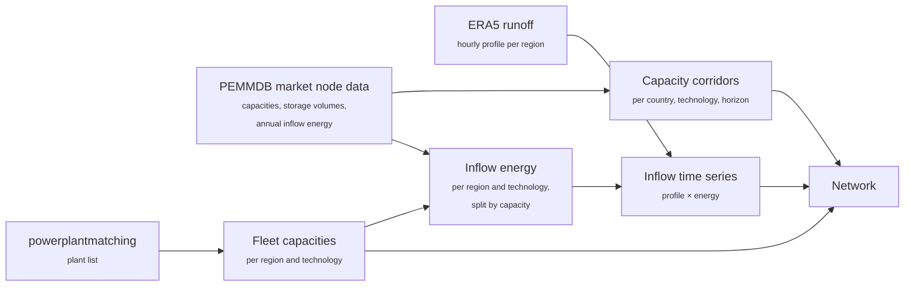
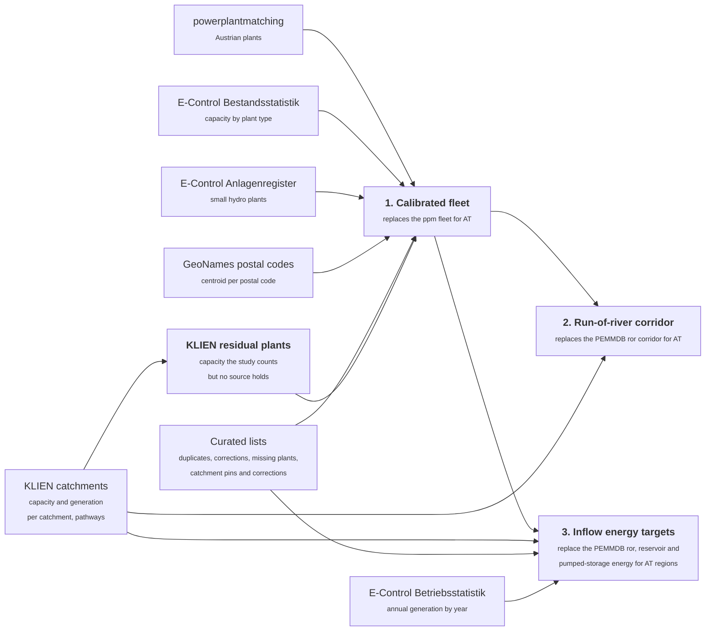

# Hydropower Capacities and Inflows

Hydropower in PyPSA-AT is described by two quantities per model region and technology: the
**capacity** that exists or may be built, and the **inflow**, the water that arrives hour by
hour and can be turbined. This page explains where both come from, why the Europe-wide data
is not good enough for Austria, and how the Austrian values are calibrated against the
E-Control statistics and the KLIEN river-catchment study.

How capacity limits are technically enforced during the solve is described in
[Generic Capacity Trajectories](capacity-trajectories.md). This page covers the hydro
*content* that feeds that mechanism.

## What the model represents

Three hydro technologies exist in the network:

| Technology | Network representation | Role of the inflow |
|------------|------------------------|--------------------|
| Run-of-river | A generator per region (`ror`). | The hourly inflow, divided by the turbine capacity, becomes the maximum availability of the generator. Water that is not turbined in that hour is lost. |
| Reservoir | A store per region (`hydro store`) with a turbine link into the electricity bus (`hydro discharger`) and an inflow generator feeding the store (`hydro inflow`). | The inflow fills the store; the optimizer decides when to turbine it. |
| Pumped storage | A store per region (`PHS store`) with a pump link (`PHS charger`), a turbine link (`PHS discharger`) and an inflow generator (`PHS inflow`). | The natural inflow into the upper reservoir; the bulk of the stored energy comes from pumping. |

An inflow time series is the product of two things that are built separately:

- a **profile**: the shape of the year, i.e. when the water comes. It is derived from
  ERA5 runoff, aggregated per model region, smoothed, and normalised to a sum of one over
  the year of the configured snapshots (2013 by default);
- an **annual energy** per region and technology in MWh, which scales the profile.

The capacity side has two layers as well: the **brownfield fleet**, the plants that exist
today, and a **capacity corridor** per country, technology and planning horizon (per model
region for Austrian run-of-river) that bounds how much the optimizer may add.

!!! info "Terminology"
    **Catchment** (German *Einzugsgebiet*): the KLIEN hydropower study divides every Austrian
    river into stretches and publishes for each stretch the polygon of the land area
    draining into it. There are 289 such catchments; 249 of them carry the installed capacity
    and the mean annual generation of the plants on the stretch.

    **Regelarbeitsvermögen (RAV)**: the mean annual generation a plant would deliver with the
    discharge of the 1991–2020 reference period. It is the study's energy figure per
    catchment.

    **Full-load hours**: annual energy divided by capacity. Run-of-river plants on the Danube
    reach 6,000 hours and more, alpine plants often less than 4,000; E-Control reports about
    4,000 hours for the whole Austrian run-of-river fleet in the below-average year 2025 and
    5,470 hours in the wet year 2013.

## Data flow

Every country, Austria included, gets its fleet, corridors and inflows from the Europe-wide
path. Countries that are split into several model regions are not skipped: the corridor is
a national total that the constraint spreads over all regions of the country, and the inflow
energy is split over the regions in proportion to installed capacity.



Austria adds three calibration steps on top, switched by a single option
(`mods.update_hydro_capacities_AT.enable`). Each step replaces one Europe-wide product for
Austria and leaves the rest untouched:



1. The **fleet** is corrected against E-Control data and operator sources
   ([Part 1](#part-1-the-austrian-brownfield-fleet)).
2. The Austrian **run-of-river corridor** becomes a per-region headroom from the KLIEN
   catchment pathway on top of the calibrated fleet; reservoir and pumped storage keep their
   PEMMDB corridors ([Part 2](#part-2-capacity-corridors)).
3. The Austrian **run-of-river and reservoir energies** are replaced by per-region targets
   built from the KLIEN catchments, and the pumped-storage natural inflow by E-Control's
   pumped-storage statistic ([Part 3](#part-3-inflows)).

## Part 1: The Austrian brownfield fleet

### Why powerplantmatching is not enough

The brownfield fleet is the fleet of **2025**: powerplantmatching (ppm) as of its current
release, the Anlagenregister with feed-in data up to 2025, and the E-Control
Bestandsstatistik 2025 as the reference. For Austrian hydropower, ppm has several kinds of
defects:

- **Wrong technology**: the Danube, Drau, Mur, Inn, Salzach and Ill chains are labelled *Reservoir*.
- **Border plants counted twice**: the Inn and Danube *Grenzkraftwerke* appear at full capacity in AT and DE.
- **Duplicate entries**: Kaprun and Malta appear as *Hauptstufe* and *Main Stage*.
- **Wrong capacities**: merged, outdated or overstated nameplates (0.3 GW net).
- **Wrong location**: plants geocoded to a same-named village or to the operator's address .
- **Missing plants**: about twenty plants above 10 MW and hundreds of plants below 10 MW.

### Curated data update files

No available dataset supplies these corrections, so PyPSA-AT fixes them by hand in six
reviewed data files: duplicates to drop, technology reclassifications and relocations,
border-plant treaty shares, missing plants, catchment pins and catchment corrections. Every
entry names the plant as ppm spells it, the capacity and region it expects to find (a guard
against changed upstream data), the correction, and a note with the rationale and the
source. The files are reviewed data, not configuration.

### Hydro powerplant calibration steps

The corrections are applied in a fixed order, each step on the result of the previous one:

| Step | What it does | Source |
|------|--------------|--------|
| **Drop duplicates** | Removes the second entry of a plant listed twice, after checking that the kept twin is present. | Duplicates list |
| **Reclassify, relocate, correct** | Moves each listed plant to the right technology (31 river-chain plants become run-of-river, Enzingerboden fed from the Tauernmoos reservoir becomes a reservoir plant), corrects nameplate capacities, and moves plants with wrong coordinates to their actual site. | Reclassification list |
| **Apply the border treaty** | Scales each Inn and Danube border plant to its 50 % Austrian share, and adds the German half on the German side where ppm lacks it. | Border-plant list with treaty shares |
| **Replace the small-hydro fleet** | Drops the incidental ppm plants ≤ 10 MW and adds every *Kleinwasserkraft bis 10 MW* plant of the Anlagenregister individually, mapped to its region by postal code and placed at the centroid of that postal code. | E-Control Anlagenregister, GeoNames postal codes |
| **Scale small hydro to E-Control** | The register's small-hydro class and E-Control's size-class accounting differ by ≈ 12.5 %. The added plants are scaled uniformly to the E-Control bottleneck capacity below 10 MW (1,543 MW), preserving the regional distribution. | E-Control Bestandsstatistik |
| **Add missing plants** | Appends plants with coordinates, so the catchment lookup in Part 3 places them on the right river. It runs after the register step, which would otherwise drop curated plants of 10 MW or less again. Plants known only from the Anlagenregister carry its id and locality, because the register publishes neither operator names nor build years. | Missing-plants list |
| **Add KLIEN residual plants** | Runs the catchment allocation of Part 3 on the fleet so far and adds, per catchment, one synthetic run-of-river plant for the capacity the study counts but no source holds, sized at the catchment's own full-load hours. | KLIEN catchments |

### Result

```plotly
{
  "data": [
    {"type": "bar", "name": "powerplantmatching", "x": ["Run-of-river", "Reservoir", "Pumped storage"], "y": [2395, 6248, 6120], "marker": {"color": "#9AA5B1"}},
    {"type": "bar", "name": "E-Control Bestandsstatistik 2025", "x": ["Run-of-river", "Reservoir", "Pumped storage"], "y": [6146, 3442, 6172], "marker": {"color": "#C08A26"}},
    {"type": "bar", "name": "KLIEN study (run-of-river and reservoir combined)", "x": ["Run-of-river", "Reservoir", "Pumped storage"], "y": [10660, null, 5096], "marker": {"color": "#1baf7a"}},
    {"type": "bar", "name": "PyPSA-AT calibrated fleet", "x": ["Run-of-river", "Reservoir", "Pumped storage"], "y": [7129, 3103, 6294], "marker": {"color": "#1F6FB2"}}
  ],
  "layout": {
    "title": {"text": "Austrian hydropower capacity by technology and source (MW)"},
    "barmode": "group",
    "yaxis": {"title": {"text": "MW"}},
    "legend": {"orientation": "h", "y": -0.2},
    "margin": {"t": 50, "b": 90}
  }
}
```

The KLIEN study counts run-of-river and reservoir plants together (10.7 GW) and excludes
pumped storage; the calibrated fleet holds 10.2 GW in those two technologies, the
difference being storage groups with pumps that the study counts as reservoirs and the
model as pumped storage. The fleet follows the study rather than E-Control because the
inflow energy of Part 3 is scaled with the study's capacities: a fleet that matches the
study catchment by catchment turbines the study's energy at the study's full-load hours.
E-Control remains the cross-check; its lower run-of-river figure does not count the ÖBB
railway plants and the industrial self-suppliers, which turbine the same rivers.

## Part 2: Capacity corridors

Corridors bound, per country, technology and planning horizon, how much capacity the
optimizer may add. Existing plants are always allowed; whether a corridor is used remains an
optimization result.

### All countries: PEMMDB

For every modelled country the corridors come from the PEMMDB market node data published with
the TYNDP scenarios. PEMMDB reports installed capacity and storage volume per market node,
year and hydro category:

| PEMMDB category | Model technology | Bounded quantity |
|-----------------|------------------|------------------|
| Run of River, Pondage | Run-of-river | Turbine capacity |
| Reservoir | Reservoir | Turbine capacity and storage volume |
| Pumped storage, open and closed loop | Pumped storage | Pump and turbine capacity and storage volume |

PEMMDB reports capacities in MW and storage volumes in GWh; the volumes are converted to
the network's MWh when the corridors are built.

A corridor is a **national** value. For a country split into several model regions
(Germany, Italy) the constraint sums the components of all regions of the country
and bounds the sum; where the buildout lands inside the country is left to the optimizer.
The first planning horizon carries no PEMMDB value and gets a zero corridor, and a corridor
below the existing fleet has the same effect: both mean "no buildout beyond the existing
fleet" (installed capacity always remains allowed). Germany, for example, has PEMMDB
corridors for all three technologies, with headroom of roughly 0.1 GW run-of-river, 0.4 GW
reservoir and 1.8 GW pumped-storage turbine capacity by 2030.

### Austria: KLIEN study

The Austrian run-of-river corridor is taken from the realisable hydropower pathway of the
KLIEN study [*Erneuerbare Energiepotenziale in Österreich für 2030 und 2040*](https://gtif-austria.info/narratives/tf2-hydropower).
The study quantifies, per catchment, how much additional river hydropower is realistically
developable under three ambition pathways (low / medium / high) and two climate scenarios
(RCP 4.5 / RCP 8.5), for today, 2040 and 2070.

The corridor is built **per model region, as a headroom on top of the calibrated fleet**.
Every catchment is located in the model regions through the plants it contains, with the
same plant-to-catchment membership the inflow allocation of Part 3 uses, so border rivers and
catchments that straddle regions follow the dams. The study's capacity increment between today
and the pathway year then becomes the run-of-river headroom of the region:

```
value(region, year) = existing run-of-river capacity(region) + ΔC(region, year)
```

The whole increment counts as run-of-river: the study does not split it by technology, and the
reservoir turbines keep their PEMMDB corridor. Capacities are interpolated linearly per
catchment between 2025 (the study's current state), 2040 and 2070 and held flat afterwards,
so the regional headrooms sum to the study's national increment in every year. Catchments
without a plant of the fleet cannot be located; the build stops if such a catchment carries
more than one megawatt of increment (today five catchments with 0.1 MW in total are dropped
with a warning).

With the default settings (medium ambition, RCP 4.5):

| Horizon | National increment | AT run-of-river upper bound (sum of the regions) |
|---------|-------------------:|-------------------------------------------------:|
| 2025 | 0 MW | 7,129 MW (calibrated brownfield fleet) |
| 2030 | +704 MW | 7,834 MW |
| 2040 | +2,113 MW | 9,242 MW |
| 2050 | +2,421 MW | 9,551 MW |

Where the growth lands is the study's choice, not the optimizer's: by 2040 the largest
headrooms are AT335 Tiroler Unterland (500 MW), AT334 Tiroler Oberland (303 MW), AT322
Pinzgau-Pongau (246 MW), AT341 Bludenz-Bregenzer Wald (141 MW), AT332 Innsbruck (109 MW),
AT212 Oberkärnten (88 MW) and AT313 Mühlviertel (65 MW); Vienna (AT130) may add 14 MW. The
earlier national bound had let the optimizer place its entire increment in Vienna, where the
Danube profile is worth 6,000 hours to every added megawatt.

In the network the existing fleet of a region is fixed at its capacity in every horizon, and a
separate vintage per horizon (`{region} ror-{year}`) carries the headroom as its maximum; the
trajectory constraint bounds the fleet plus all vintages of the region, so the headroom is
cumulative over the horizons. A new megawatt does not automatically run at the fleet's hours.
The study's marginal energy per added megawatt, ΔE/ΔC of the region's catchments (3,433 hours
nationally in the reference period), is compared with the full-load hours of the region's
existing fleet, and the vintage receives the fleet's profile times `min(1, marginal / existing)`.
That factor is one in most regions, because the study's remaining stretches yield more hours
than the small plants that dominate the existing regional fleets; it is 0.46 in AT334 and
0.51 in AT335, where the remaining stretches yield about 2,000 hours against 4,000–4,600 for
the existing fleet, and 0.83–0.95 in AT323, AT225, AT313 and AT121. Other countries get the
same vintage structure with the node's share of the national PEMMDB headroom, at the fleet's
hours.

Reservoir turbines and pumped-storage turbines and pumps remain expandable within their
PEMMDB corridors (roughly +2.2 GW of pumped-storage turbine capacity by 2040, none for
reservoir turbines); the storage volumes are fixed at the existing values.

## Part 3: Inflows

### All countries: ERA5 profile times PEMMDB energy

The profile is hourly ERA5 runoff, aggregated over each model region, smoothed and normalised
to the configured weather year. The annual energy comes from the PEMMDB inflow tables of the
TYNDP scenarios, which give one energy per market node and hydro category (run-of-river and
pondage, reservoir, open- and closed-loop pumped storage). The country energy is spread over
the regions of the country in proportion to the installed capacity of the *calibrated* fleet.
For run-of-river the national energy is first scaled by the ratio of model run-of-river
capacity to the PEMMDB run-of-river plus pondage capacity, so a fleet correction directly
changes the river energy of the country.

### The KLIEN catchment data

The KLIEN study publishes, per catchment, the current Regelarbeitsvermögen of all
*Lauf- und Speicherkraftwerke*: 249 catchments with a value, summing to 44.0 TWh/a
(Langfassung §4.3.2, data status November 2024), together with the installed capacity per
catchment. Pumped-storage plants are **excluded** from this figure, and the catchments they
sit in are treated as fully developed. The per-catchment values are the calibration source
for the Austrian run-of-river and reservoir energy; the generation reported by E-Control is
the check on the result.

The study is not free of errors. Where operator data proves a catchment wrong, the curated
catchment corrections replace its capacity and energy before the allocation. Two cases are
known: the lower Enns below Steyr, where the study books the Ennskraftwerke company total
(215 MW, 980 GWh/a) on a 97 km² stretch whose plants sum to 123 MW and 576 GWh/a; and the
Inn at the Bavarian border, where the study's 108 MW include Verbund's Nußdorf plant, which
lies in Bavaria. Without the corrections, 0.65 TWh/a of phantom energy would be reported as
unmatched in every run.

### From runoff profile to hourly inflow

The figures in this subsection come from `.marimo/review-hydro-slides.py`, run on the
365H reference run `hydro-capacities-update-complete` (weather year 2013, 24 snapshots of
365 hours). The hourly curves are the resources the run was built from; the last panel of
each step figure is the solved network.

**The profile is built from runoff.** `build_inflow_profile` takes the hourly ERA5 runoff of
the cutout, applies atlite's smoothing, aggregates it over each model region and normalises
it so that every region's profile sums to one over the weather
year. The same profile serves every country. The result is the share of the year's water
that arrives in each hour, not a quantity: the profile of a Danube region and that of a
small alpine valley both sum to one.

**The profile depicts timing, not amount.** A June peak does not mean "much water"; it means
"a large share of this year's water arrives now". The cutout year decides when the snowmelt
and the summer floods happen, and it carries no megawatt-hour of its own. In the figure
below, panel a shows the AT322 profile summing to one, and panel c shows that the cumulative
share is the same curve whichever annual energy it is later multiplied with: half of the
year's water has arrived by 21 June in 2013, in a dry year as in a wet one.


**The amount comes from the KLIEN energy.** The catchment Regelarbeitsvermögen is allocated
to the plants and rolled up per region and technology (next subsection). Multiplied with the
profile it gives the hourly inflow in MW (step 2 of the figure below). For run-of-river the
availability is `p_max_pu = inflow / p_nom`, so that `p_max_pu × p_nom` is the power the
river makes available in that hour; hours in which the inflow exceeds the turbine capacity
are capped at one and the capped energy is redistributed over the other hours, so the annual
energy is conserved (step 3). The reservoir
and pumped-storage inflow feeds an inflow generator whose nominal power is the peak inflow
(step 4); the store absorbs the peaks, so nothing is redistributed there. Step 5 is what the
solved network sees once the hours are aggregated to its snapshots.


**Dry and wet years share the shape.** The KLIEN energy is a long-term mean, so it is scaled
per carrier with the hydrology of the weather year taken from E-Control: the full-load hours
of the Laufkraftwerke for run-of-river, those of the Speicherkraftwerke without pumped storage
for reservoirs, and the natural inflow of the pumped-storage plants (see
[Weather-year scaling](#weather-year-scaling)). The same 2013 shape then represents the dry
year 2003, the model year 2013 or the wet year 2024; only the scale changes (panel b of the
first figure). The current run uses the weather year 2013 with a run-of-river factor of 1.05.
The last figure puts the 2025 fleet through every E-Control year since 2000 and compares the
delivered natural inflow with the 47 TWh EAG hydro floor of 2030 (see [EAG §4(4) — Renewable Expansion Targets](regulatory-requirements/eag-renewable-expansion-targets.md));
stacked on top is the energy the KLIEN run-of-river corridor would add by 2030 and 2040 if the
added capacity ran at the fleet's full-load hours.


### Allocation: energy follows the plants

Rather than splitting catchment energy by the area a region shares with the catchment, the
energy of each catchment is given to the plants inside it and then rolled up by the plants'
region using the plants postal code or coordinates. 

### Pumped storage: natural inflow from E-Control

The Austrian pumped-storage inflow is therefore taken from E-Control: the generation of the pumped-storage plants minus the
generation from pumped water, which the Betriebsstatistik year series publishes per year
(*davon Erzeugung aus Pumpspeicherung*). The resulting natural generation is 3.15 TWh/a on
average over the reference period and 3.6 TWh in the wet year 2013, scaled to
the weather year like the other carriers and spread over the Austrian regions in proportion
to the pumped-storage turbine capacity of the calibrated fleet, because the statistic knows
no regions. Nothing is counted twice: the KLIEN energy the allocation attributes to
pumped-storage plants is dropped.

### Weather-year scaling

The catchment energy is a long-term mean, but the ERA5 profile belongs to one weather year.
To be consistent, the KLIEN energy is scaled to that year with the E-Control Betriebsstatistik
and Bestandsstatistik year series. The factor is meant to carry the hydrology of the year only,
so it is built on **full-load hours**, not on generation: the generation of a year reflects
the fleet (installed capacity) of that year as much as its rivers.

The sign and size of the factor are hydrology, not a property of the method: the KLIEN energy
contains no weather, and the factor is simply how the rivers of that year compared with the
1991–2020 mean from the **Betriebsstatistik**. 
2024 was a record hydro year with high snowmelt and a rainy summer, 2025 followed a dry winter 
and spring, so the same fleet swings by about 30 % of its run-of-river energy between two adjacent 
years.

| Year | Laufkraft | Capacity | Hours | Factor ror | Speicherkraft without PS | Hours | Factor hydro | PS natural inflow | Factor PHS |
|------|----------:|---------:|------:|-----------:|-------------------------:|------:|-------------:|------------------:|-----------:|
| 2010 | 28.0 TWh | 5,398 MW | 5,187 h |       0.99 | 6.7 TWh | 2,388 h | 0.99 | 3.5 TWh | 1.11 |
| 2011 | 25.3 TWh | 5,429 MW | 4,663 h |       0.89 | 5.9 TWh | 2,104 h | 0.87 | 2.9 TWh | 0.92 |
| 2012 | 31.5 TWh | 5,488 MW | 5,740 h |       1.10 | 7.8 TWh | 2,768 h | 1.15 | 3.7 TWh | 1.19 |
| 2013 | 30.5 TWh | 5,555 MW | 5,494 h |       1.05 | 7.1 TWh | 2,545 h | 1.06 | 3.6 TWh | 1.14 |
| 2014 | 29.7 TWh | 5,601 MW | 5,310 h |       1.02 | 6.9 TWh | 2,456 h | 1.02 | 3.8 TWh | 1.22 |
| 2015 | 26.7 TWh | 5,642 MW | 4,735 h |       0.91 | 6.6 TWh | 2,356 h | 0.98 | 3.6 TWh | 1.15 |
| 2016 | 29.3 TWh | 5,681 MW | 5,157 h |       0.99 | 6.9 TWh | 2,413 h | 1.00 | 3.5 TWh | 1.11 |
| 2017 | 28.9 TWh | 5,708 MW | 5,059 h |       0.97 | 7.1 TWh | 2,265 h | 0.94 | 2.8 TWh | 0.90 |
| 2018 | 27.4 TWh | 5,719 MW | 4,786 h |       0.92 | 7.8 TWh | 2,218 h | 0.92 | 2.5 TWh | 0.80 |
| 2019 | 30.0 TWh | 5,760 MW | 5,204 h |       1.00 | 8.4 TWh | 2,325 h | 0.97 | 2.5 TWh | 0.80 |
| 2020 | 30.7 TWh | 5,800 MW | 5,293 h |       1.01 | 8.4 TWh | 2,306 h | 0.96 | 3.1 TWh | 0.99 |
| 2021 | 28.5 TWh | 5,819 MW | 4,891 h |       0.94 | 7.2 TWh | 2,044 h | 0.85 | 3.1 TWh | 1.00 |
| 2022 | 25.7 TWh | 5,894 MW | 4,354 h |       0.83 | 6.2 TWh | 1,835 h | 0.76 | 2.8 TWh | 0.89 |
| 2023 | 29.7 TWh | 5,976 MW | 4,963 h |       0.95 | 7.6 TWh | 2,225 h | 0.92 | 3.6 TWh | 1.15 |
| 2024 | 33.3 TWh | 6,064 MW | 5,491 h |       1.05 | 8.4 TWh | 2,469 h | 1.03 | 4.1 TWh | 1.30 |
| 2025 | 24.4 TWh | 6,138 MW | 3,979 h |       0.76 | 5.8 TWh | 1,688 h | 0.70 | 3.1 TWh | 0.97 |

### Result against E-Control 

The calibration target is the generation reported by E-Control. The model runs the 2025 fleet
with the 2013 weather year, so the fairest comparison is the E-Control year 2013 in full-load
hours, which are independent of the fleet size (E-Control 2013: 5,580 MW of Laufkraftwerke
generating 30.5 TWh):

| Quantity | Model (2013 weather year) | E-Control Betriebsstatistik 2013 |
|----------|--------------------------:|---------------------------------:|
| Run-of-river energy | 33.4 TWh | 30.5 TWh Laufkraft |
| Reservoir inflow energy | 9.3 TWh | 7.1 TWh Speicherkraft without pumped-storage plants |
| Run-of-river full-load hours | 4,690 h | 5,470 h |

PyPSA-AT reproduces the KLIEN study's long-term energy in every catchment: with the
residual plants, only 3 GWh/a of the KLIEN energy stay unallocated. The run-of-river energy
exceeds E-Control's 2013 generation by 9 %, which is the fleet vintage (the 2025 fleet is
1 GW larger than the 2013 one) plus the plants E-Control does not count. In full-load hours
the model sits 14 % below E-Control's 2013 figure for the same reason: the plants added
since 2013, and the residual plants, sit mostly in alpine valleys with fewer hours than the
Danube chain. The four Danube regions (AT121, AT126, AT130, AT313) sit at
6,000–6,200 hours, consistent with the catchment values and the operators' figures for the
Danube chain. Plants whose coordinates fall inside a catchment polygon without a KLIEN energy
value (91 small plants, 39 MW) are spread over the catchments of their region by area, like
plants with an unknown postal code.

On the storage side, E-Control's Speicherkraft generation of 2013 (15.2 TWh) splits into
8.0 TWh from pumped-storage plants, of which 3.6 TWh from natural inflow and 4.4 TWh from
pumped water, and 7.1 TWh from the other storage plants. The model's pumped-storage inflow
equals the E-Control natural figure by construction. Its reservoir capacity (3,103 MW) lies
between the E-Control 2013 and 2025 Speicherkraftwerke without pumped storage (2,795 and
3,442 MW), but its reservoir inflow of 9.3 TWh is 2.2 TWh above E-Control's 7.1 TWh. The
boundary between reservoir and pumped-storage plants is drawn differently by E-Control,
KLIEN and ppm, so part of the energy that E-Control books under pumped storage lands on the
reservoir class here. Together the storage carriers hold 12.9 TWh of natural inflow
against 10.7 TWh in E-Control, a remaining surplus of 2.2 TWh that sits on the
reservoir side. This is an open item.

